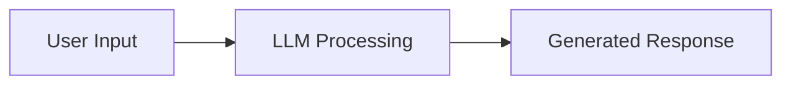
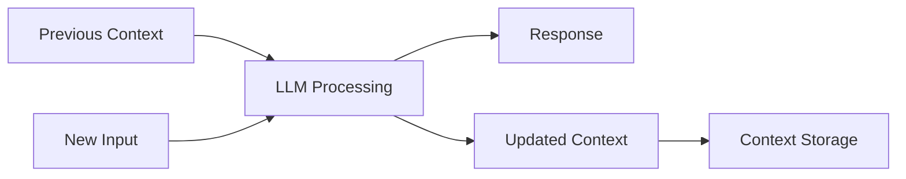
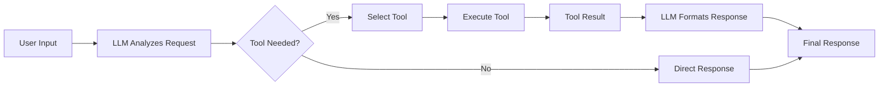
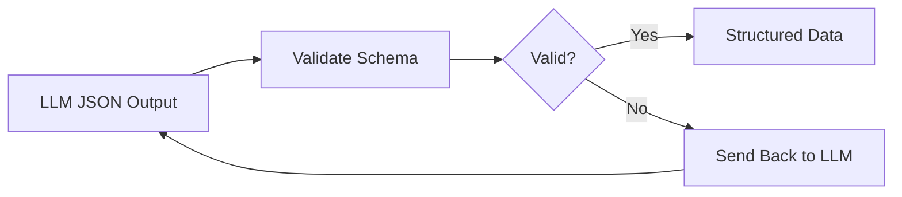
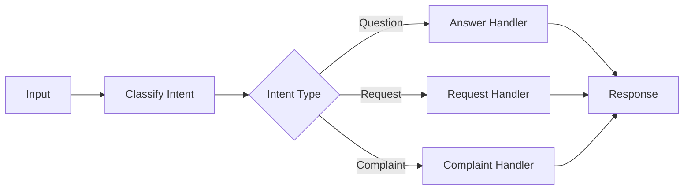
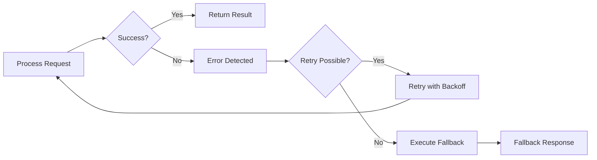
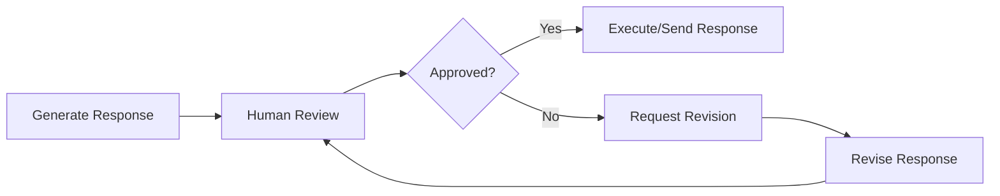

I will be giving a lecture on agentic AI systems to graduate students in a masters of data science program. The students are in their final semester.

I will focus on generative models (primarily LLMs) and provide practical insights on how to successfully build reliable systems with this technology

I would like to use a few key resources as references for these slides:

- <https://www.anthropic.com/engineering/building-effective-agents>
- <https://www.anthropic.com/engineering/multi-agent-research-system>
- <https://minusx.ai/blog/decoding-claude-code/>
- <https://www.philschmid.de/agentic-pattern>
- <https://www.agentrecipes.com/>
- The contents of `<ai-cookbook>` and `<openai-agents>` below

Let's research together and collaborate on an outline before trying to write any slides.

My initial thoughts include

- I want to prioritize simplicity. Whenever possible have a single agent. If not possible at least have a single main thread (lead agent) that controls the application
- Modern agents are build on generative models. Generative models are inherently non-deterministic. Requires careful scaffolding to get reliable results
- My definition of agent is an LLM with access to tools running in a loop.
- I would like to work towards having them build a simple agent using each of the architectures we developed. We'll have them do this in plain - Python without abstractions like langchain or other
- Please carefully review all resources, consider my thoughts above, think hard, and propose an outline that we will iterate on. The outline should be a single unordered list -- each top level list item is a slide, max depth 3 to show slide content. each list item (or sub list item) should be 10 words or less

<ai-cookbook>

```txt
Directory structure:
└── daveebbelaar-ai-cookbook/
    └── agents/
        └── building-blocks/
            ├── README.md
            ├── 1-intelligence.py
            ├── 2-memory.py
            ├── 3-tools.py
            ├── 4-validation.py
            ├── 5-control.py
            ├── 6-recovery.py
            ├── 7-feedback.py
            └── requirements.txt


Files Content:

================================================
FILE: agents/building-blocks/README.md
================================================
# The 7 Foundational Building Blocks of AI Agents

## What I Learned Building Real AI Applications

Here's what I've observed after trying countless agent frameworks and talking to developers building real AI products: **the frameworks aren't being used in production**.

Most successful AI applications I've seen are built with custom building blocks, not frameworks. This is because most effective "AI agents" aren't actually that agentic at all. They're mostly deterministic software with strategic LLM calls placed exactly where they add value.

The problem is that most frameworks push the "give an LLM some tools and let it figure everything out" approach. But in reality, you don't want your LLM making every decision. You want it handling the one thing it's good at - reasoning with context - while your code handles everything else.

**The solution is simpler than most frameworks make it seem.** Here's the approach that actually works:

- Break down what you're actually building into fundamental components
- Solve each problem with proper software engineering best practices  
- **ONLY INCLUDE AN LLM STEP** when it's impossible to solve with deterministic code

Making an LLM API call is the most expensive and most dangerous operation in modern software development. While incredibly powerful, you want to avoid it at all costs and only use it when absolutely necessary. 

This is especially true for background automation systems. There's a huge difference between building personal assistants (like ChatGPT, Cursor) where users are in the loop, versus building fully automated systems that process information or handle workflows without human intervention. Most of you aren't building the next ChatGPT - you're building background automations to make your work or company more efficient.

**But when you do make that LLM call, it's all about context engineering.** To get a good answer back, you need the right context at the right time sent to the right model. You need to pre-process all available information, prompts, and user input so the LLM can easily and reliably solve the problem. This is the most fundamental skill in working with LLMs.

AI agents are simply workflows - directed acyclic graphs (DAGs) if you're being precise, or just graphs if you include loops. Most steps in these workflows should be regular code - not LLM calls.

## The 7 Building Blocks

Given all of this, you only need these seven core building blocks to solve almost any business problem. Take your big problem, break it down into smaller problems, then solve each one using these building blocks chained together - that's how you build effective AI agents.

These are the fundamental primitives. But how do you actually combine them? That's where [workflow orchestration](https://github.com/daveebbelaar/ai-cookbook/tree/main/patterns/workflows) comes in - prompt chaining, routing, reflection, and other agentic patterns that emerge when you combine these building blocks strategically.

### 1. Intelligence
**The only truly "AI" component**

This is where the magic happens - and it's surprisingly simple. You send text to an LLM, it thinks about it, and sends text back. That's it. **Without this, you just have regular software.** The tricky part isn't the LLM call itself - it's everything else you need to build around it.



### 2. Memory
**Context persistence across interactions**

LLMs don't remember anything from previous messages. **Without memory, each interaction starts from scratch** because LLMs are stateless. So you need to manually pass in the conversation history each time. This is just *storing and passing conversation state* - something we've been doing in web apps forever.



### 3. Tools
**External system integration capabilities**

Most of the time you need your LLM to actually do stuff, not just chat. **Pure text generation is limited** - you want to call APIs, update databases, or read files. Tools let the LLM say "I need to call this function with these parameters" and your code handles the actual execution. This is just *normal API integration* where the LLM picks what to call and provides JSON input for the arguments.



### 4. Validation
**Quality assurance and structured data enforcement**

You need to make sure the LLM returns JSON that matches your expected schema. **LLMs are probabilistic and can produce inconsistent outputs**, so you validate the JSON output against a predefined structure. If validation fails, you can send it back to the LLM to fix it. This ensures downstream code can reliably work with the data. This is just *normal schema validation* with retry logic using tools like Pydantic, Zod, or data classes.



### 5. Control
**Deterministic decision-making and process flow**

You don't want your LLM making every decision - some things should be handled by regular code. Use if/else statements, switch cases, and routing logic to direct flow based on conditions. This is just *normal business logic and routing* that you'd write in any application.



### 6. Recovery
**Graceful failure management**

**Things will go wrong** - APIs will be down, LLMs will return nonsense, rate limits will hit you. You need try/catch blocks, retry logic with backoff, and fallback responses when stuff breaks. This is just *standard error handling* that you'd implement in any production system.



### 7. Feedback
**Human oversight and approval workflows**

Sometimes you need a human to check the LLM's work before it goes live. **Some decisions are too important or complex for full automation** - like sending emails to customers or making purchases. Add approval steps where humans can review and approve/reject before execution. This is just *basic approval workflows* like you'd build for any app.




================================================
FILE: agents/building-blocks/1-intelligence.py
================================================
"""
Intelligence: The "brain" that processes information and makes decisions using LLMs.
This component handles context understanding, instruction following, and response generation.

More info: https://platform.openai.com/docs/guides/text?api-mode=responses
"""

from openai import OpenAI


def basic_intelligence(prompt: str) -> str:
    client = OpenAI()
    response = client.responses.create(model="gpt-4o", input=prompt)
    return response.output_text


if __name__ == "__main__":
    result = basic_intelligence(prompt="What is artificial intelligence?")
    print("Basic Intelligence Output:")
    print(result)


================================================
FILE: agents/building-blocks/2-memory.py
================================================
"""
Memory: Stores and retrieves relevant information across interactions.
This component maintains conversation history and context to enable coherent multi-turn interactions.

More info: https://platform.openai.com/docs/guides/conversation-state?api-mode=responses
"""

from openai import OpenAI

client = OpenAI()


def ask_joke_without_memory():
    response = client.responses.create(
        model="gpt-4o-mini",
        input=[
            {"role": "user", "content": "Tell me a joke about programming"},
        ],
    )
    return response.output_text


def ask_followup_without_memory():
    response = client.responses.create(
        model="gpt-4o-mini",
        input=[
            {"role": "user", "content": "What was my previous question?"},
        ],
    )
    return response.output_text


def ask_followup_with_memory(joke_response: str):
    response = client.responses.create(
        model="gpt-4o-mini",
        input=[
            {"role": "user", "content": "Tell me a joke about programming"},
            {"role": "assistant", "content": joke_response},
            {"role": "user", "content": "What was my previous question?"},
        ],
    )
    return response.output_text


if __name__ == "__main__":
    # First: Ask for a joke
    joke_response = ask_joke_without_memory()
    print(joke_response, "\n")

    # Second: Ask follow-up without memory (AI will be confused)
    confused_response = ask_followup_without_memory()
    print(confused_response, "\n")

    # Third: Ask follow-up with memory (AI will remember)
    memory_response = ask_followup_with_memory(joke_response)
    print(memory_response)


================================================
FILE: agents/building-blocks/3-tools.py
================================================
"""
Tools: Enables agents to execute specific actions in external systems.
This component provides the capability to make API calls, database updates, file operations, and other practical actions.


More info: https://platform.openai.com/docs/guides/function-calling?api-mode=responses
"""

import json
import requests
from openai import OpenAI


def get_weather(latitude, longitude):
    response = requests.get(
        f"https://api.open-meteo.com/v1/forecast?latitude={latitude}&longitude={longitude}&current=temperature_2m,wind_speed_10m"
    )
    data = response.json()
    return data["current"]["temperature_2m"]


def call_function(name, args):
    if name == "get_weather":
        return get_weather(**args)
    raise ValueError(f"Unknown function: {name}")


def intelligence_with_tools(prompt: str) -> str:
    client = OpenAI()

    tools = [
        {
            "type": "function",
            "name": "get_weather",
            "description": "Get current temperature for provided coordinates in celsius.",
            "parameters": {
                "type": "object",
                "properties": {
                    "latitude": {"type": "number"},
                    "longitude": {"type": "number"},
                },
                "required": ["latitude", "longitude"],
                "additionalProperties": False,
            },
            "strict": True,
        }
    ]

    input_messages = [{"role": "user", "content": prompt}]

    # Step 1: Call model with tools
    response = client.responses.create(
        model="gpt-4o",
        input=input_messages,
        tools=tools,
    )

    # Step 2: Handle function calls
    for tool_call in response.output:
        if tool_call.type == "function_call":
            # Step 3: Execute function
            name = tool_call.name
            args = json.loads(tool_call.arguments)
            result = call_function(name, args)

            # Step 4: Append function call and result to messages
            input_messages.append(tool_call)
            input_messages.append(
                {
                    "type": "function_call_output",
                    "call_id": tool_call.call_id,
                    "output": str(result),
                }
            )

    # Step 5: Get final response with function results
    final_response = client.responses.create(
        model="gpt-4o",
        input=input_messages,
        tools=tools,
    )

    return final_response.output_text


if __name__ == "__main__":
    result = intelligence_with_tools(prompt="What's the weather like in Paris today?")
    print("Tool Calling Output:")
    print(result)


================================================
FILE: agents/building-blocks/4-validation.py
================================================
"""
Validation: Ensures LLM outputs match predefined data schemas.
This component provides schema validation and structured data parsing to guarantee consistent data formats for downstream code.

More info: https://platform.openai.com/docs/guides/structured-outputs?api-mode=responses
"""

from openai import OpenAI
from pydantic import BaseModel


class TaskResult(BaseModel):
    """
    More info: https://docs.pydantic.dev
    """

    task: str
    completed: bool
    priority: int


def structured_intelligence(prompt: str) -> TaskResult:
    client = OpenAI()
    response = client.responses.parse(
        model="gpt-4o",
        input=[
            {
                "role": "system",
                "content": "Extract task information from the user input.",
            },
            {"role": "user", "content": prompt},
        ],
        text_format=TaskResult,
    )
    return response.output_parsed


if __name__ == "__main__":
    result = structured_intelligence(
        "I need to complete the project presentation by Friday, it's high priority"
    )
    print("Structured Output:")
    print(result.model_dump_json(indent=2))
    print(f"Extracted task: {result.task}")


================================================
FILE: agents/building-blocks/5-control.py
================================================
"""
Control: Provides deterministic decision-making and process flow control.
This component handles if/then logic, routing based on conditions, and process orchestration for predictable behavior.
"""

from openai import OpenAI
from pydantic import BaseModel
from typing import Literal


class IntentClassification(BaseModel):
    intent: Literal["question", "request", "complaint"]
    confidence: float
    reasoning: str


def route_based_on_intent(user_input: str) -> tuple[str, IntentClassification]:
    client = OpenAI()
    response = client.responses.parse(
        model="gpt-4o",
        input=[
            {
                "role": "system",
                "content": "Classify user input into one of three categories: question, request, or complaint. Provide your reasoning and confidence level.",
            },
            {"role": "user", "content": user_input},
        ],
        text_format=IntentClassification,
    )

    classification = response.output_parsed
    intent = classification.intent

    if intent == "question":
        result = answer_question(user_input)
    elif intent == "request":
        result = process_request(user_input)
    elif intent == "complaint":
        result = handle_complaint(user_input)
    else:
        result = "I'm not sure how to help with that."

    return result, classification


def answer_question(question: str) -> str:
    client = OpenAI()
    response = client.responses.create(
        model="gpt-4o", input=f"Answer this question: {question}"
    )
    return response.output[0].content[0].text


def process_request(request: str) -> str:
    return f"Processing your request: {request}"


def handle_complaint(complaint: str) -> str:
    return f"I understand your concern about: {complaint}. Let me escalate this."


if __name__ == "__main__":
    # Test different types of inputs
    test_inputs = [
        "What is machine learning?",
        "Please schedule a meeting for tomorrow",
        "I'm unhappy with the service quality",
    ]

    for user_input in test_inputs:
        print(f"\nInput: {user_input}")
        result, classification = route_based_on_intent(user_input)
        print(
            f"Intent: {classification.intent} (confidence: {classification.confidence})"
        )
        print(f"Reasoning: {classification.reasoning}")
        print(f"Response: {result}")


================================================
FILE: agents/building-blocks/6-recovery.py
================================================
"""
Recovery: Manages failures and exceptions gracefully in agent workflows.
This component implements retry logic, fallback processes, and error handling to ensure system resilience.
"""

from typing import Optional
from openai import OpenAI
from pydantic import BaseModel


class UserInfo(BaseModel):
    name: str
    email: str
    age: Optional[int] = None  # Optional field


def resilient_intelligence(prompt: str) -> str:
    client = OpenAI()

    # Get structured output
    response = client.responses.parse(
        model="gpt-4o",
        input=[
            {"role": "system", "content": "Extract user information from the text."},
            {"role": "user", "content": prompt},
        ],
        text_format=UserInfo,
        temperature=0.0,
    )

    user_data = response.output_parsed.model_dump()

    try:
        # Try to access age field and check if it's valid
        age = user_data["age"]
        if age is None:
            raise ValueError("Age is None")
        age_info = f"User is {age} years old"
        return age_info

    except (KeyError, TypeError, ValueError):
        print("❌ Age not available, using fallback info...")

        # Fallback to available information
        return f"User {user_data['name']} has email {user_data['email']}"


if __name__ == "__main__":
    result = resilient_intelligence(
        "My name is John Smith and my email is john@example.com"
    )
    print("Recovery Output:")
    print(result)


================================================
FILE: agents/building-blocks/7-feedback.py
================================================
"""
Feedback: Provides strategic points where human judgement is required.
This component implements approval workflows and human-in-the-loop processes for high-risk decisions or complex judgments.
"""

from openai import OpenAI


def get_human_approval(content: str) -> bool:
    print(f"Generated content:\n{content}\n")
    response = input("Approve this? (y/n): ")
    return response.lower().startswith("y")


def intelligence_with_human_feedback(prompt: str) -> None:
    client = OpenAI()

    response = client.responses.create(model="gpt-4o", input=prompt)
    draft_response = response.output_text

    if get_human_approval(draft_response):
        print("Final answer approved")
    else:
        print("Answer not approved")


if __name__ == "__main__":
    intelligence_with_human_feedback("Write a short poem about technology")


================================================
FILE: agents/building-blocks/requirements.txt
================================================
openai==1.97.1
requests==2.32.4
```

</ai-cookbook>

<openai-agents>

```txt
Directory structure:
└── openai-openai-agents-python/
    └── examples/
        └── agent_patterns/
            ├── README.md
            ├── agents_as_tools.py
            ├── agents_as_tools_conditional.py
            ├── deterministic.py
            ├── forcing_tool_use.py
            ├── input_guardrails.py
            ├── llm_as_a_judge.py
            ├── output_guardrails.py
            ├── parallelization.py
            ├── routing.py
            └── streaming_guardrails.py


Files Content:

================================================
FILE: examples/agent_patterns/README.md
================================================
# Common agentic patterns

This folder contains examples of different common patterns for agents.

## Deterministic flows

A common tactic is to break down a task into a series of smaller steps. Each task can be performed by an agent, and the output of one agent is used as input to the next. For example, if your task was to generate a story, you could break it down into the following steps:

1. Generate an outline
2. Generate the story
3. Generate the ending

Each of these steps can be performed by an agent. The output of one agent is used as input to the next.

See the [`deterministic.py`](./deterministic.py) file for an example of this.

## Handoffs and routing

In many situations, you have specialized sub-agents that handle specific tasks. You can use handoffs to route the task to the right agent.

For example, you might have a frontline agent that receives a request, and then hands off to a specialized agent based on the language of the request.
See the [`routing.py`](./routing.py) file for an example of this.

## Agents as tools

The mental model for handoffs is that the new agent "takes over". It sees the previous conversation history, and owns the conversation from that point onwards. However, this is not the only way to use agents. You can also use agents as a tool - the tool agent goes off and runs on its own, and then returns the result to the original agent.

For example, you could model the translation task above as tool calls instead: rather than handing over to the language-specific agent, you could call the agent as a tool, and then use the result in the next step. This enables things like translating multiple languages at once.

See the [`agents_as_tools.py`](./agents_as_tools.py) file for an example of this.

## LLM-as-a-judge

LLMs can often improve the quality of their output if given feedback. A common pattern is to generate a response using a model, and then use a second model to provide feedback. You can even use a small model for the initial generation and a larger model for the feedback, to optimize cost.

For example, you could use an LLM to generate an outline for a story, and then use a second LLM to evaluate the outline and provide feedback. You can then use the feedback to improve the outline, and repeat until the LLM is satisfied with the outline.

See the [`llm_as_a_judge.py`](./llm_as_a_judge.py) file for an example of this.

## Parallelization

Running multiple agents in parallel is a common pattern. This can be useful for both latency (e.g. if you have multiple steps that don't depend on each other) and also for other reasons e.g. generating multiple responses and picking the best one.

See the [`parallelization.py`](./parallelization.py) file for an example of this. It runs a translation agent multiple times in parallel, and then picks the best translation.

## Guardrails

Related to parallelization, you often want to run input guardrails to make sure the inputs to your agents are valid. For example, if you have a customer support agent, you might want to make sure that the user isn't trying to ask for help with a math problem.

You can definitely do this without any special Agents SDK features by using parallelization, but we support a special guardrail primitive. Guardrails can have a "tripwire" - if the tripwire is triggered, the agent execution will immediately stop and a `GuardrailTripwireTriggered` exception will be raised.

This is really useful for latency: for example, you might have a very fast model that runs the guardrail and a slow model that runs the actual agent. You wouldn't want to wait for the slow model to finish, so guardrails let you quickly reject invalid inputs.

See the [`input_guardrails.py`](./input_guardrails.py) and [`output_guardrails.py`](./output_guardrails.py) files for examples.


================================================
FILE: examples/agent_patterns/agents_as_tools.py
================================================
import asyncio

from agents import Agent, ItemHelpers, MessageOutputItem, Runner, trace

"""
This example shows the agents-as-tools pattern. The frontline agent receives a user message and
then picks which agents to call, as tools. In this case, it picks from a set of translation
agents.
"""

spanish_agent = Agent(
    name="spanish_agent",
    instructions="You translate the user's message to Spanish",
    handoff_description="An english to spanish translator",
)

french_agent = Agent(
    name="french_agent",
    instructions="You translate the user's message to French",
    handoff_description="An english to french translator",
)

italian_agent = Agent(
    name="italian_agent",
    instructions="You translate the user's message to Italian",
    handoff_description="An english to italian translator",
)

orchestrator_agent = Agent(
    name="orchestrator_agent",
    instructions=(
        "You are a translation agent. You use the tools given to you to translate."
        "If asked for multiple translations, you call the relevant tools in order."
        "You never translate on your own, you always use the provided tools."
    ),
    tools=[
        spanish_agent.as_tool(
            tool_name="translate_to_spanish",
            tool_description="Translate the user's message to Spanish",
        ),
        french_agent.as_tool(
            tool_name="translate_to_french",
            tool_description="Translate the user's message to French",
        ),
        italian_agent.as_tool(
            tool_name="translate_to_italian",
            tool_description="Translate the user's message to Italian",
        ),
    ],
)

synthesizer_agent = Agent(
    name="synthesizer_agent",
    instructions="You inspect translations, correct them if needed, and produce a final concatenated response.",
)


async def main():
    msg = input("Hi! What would you like translated, and to which languages? ")

    # Run the entire orchestration in a single trace
    with trace("Orchestrator evaluator"):
        orchestrator_result = await Runner.run(orchestrator_agent, msg)

        for item in orchestrator_result.new_items:
            if isinstance(item, MessageOutputItem):
                text = ItemHelpers.text_message_output(item)
                if text:
                    print(f"  - Translation step: {text}")

        synthesizer_result = await Runner.run(
            synthesizer_agent, orchestrator_result.to_input_list()
        )

    print(f"\n\nFinal response:\n{synthesizer_result.final_output}")


if __name__ == "__main__":
    asyncio.run(main())


================================================
FILE: examples/agent_patterns/agents_as_tools_conditional.py
================================================
import asyncio

from pydantic import BaseModel

from agents import Agent, AgentBase, RunContextWrapper, Runner, trace

"""
This example demonstrates the agents-as-tools pattern with conditional tool enabling.
Agent tools are dynamically enabled/disabled based on user access levels using the
is_enabled parameter.
"""


class AppContext(BaseModel):
    language_preference: str = "spanish_only"  # "spanish_only", "french_spanish", "european"


def french_spanish_enabled(ctx: RunContextWrapper[AppContext], agent: AgentBase) -> bool:
    """Enable for French+Spanish and European preferences."""
    return ctx.context.language_preference in ["french_spanish", "european"]


def european_enabled(ctx: RunContextWrapper[AppContext], agent: AgentBase) -> bool:
    """Only enable for European preference."""
    return ctx.context.language_preference == "european"


# Create specialized agents
spanish_agent = Agent(
    name="spanish_agent",
    instructions="You respond in Spanish. Always reply to the user's question in Spanish.",
)

french_agent = Agent(
    name="french_agent",
    instructions="You respond in French. Always reply to the user's question in French.",
)

italian_agent = Agent(
    name="italian_agent",
    instructions="You respond in Italian. Always reply to the user's question in Italian.",
)

# Create orchestrator with conditional tools
orchestrator = Agent(
    name="orchestrator",
    instructions=(
        "You are a multilingual assistant. You use the tools given to you to respond to users. "
        "You must call ALL available tools to provide responses in different languages. "
        "You never respond in languages yourself, you always use the provided tools."
    ),
    tools=[
        spanish_agent.as_tool(
            tool_name="respond_spanish",
            tool_description="Respond to the user's question in Spanish",
            is_enabled=True,  # Always enabled
        ),
        french_agent.as_tool(
            tool_name="respond_french",
            tool_description="Respond to the user's question in French",
            is_enabled=french_spanish_enabled,
        ),
        italian_agent.as_tool(
            tool_name="respond_italian",
            tool_description="Respond to the user's question in Italian",
            is_enabled=european_enabled,
        ),
    ],
)


async def main():
    """Interactive demo with LLM interaction."""
    print("Agents-as-Tools with Conditional Enabling\n")
    print(
        "This demonstrates how language response tools are dynamically enabled based on user preferences.\n"
    )

    print("Choose language preference:")
    print("1. Spanish only (1 tool)")
    print("2. French and Spanish (2 tools)")
    print("3. European languages (3 tools)")

    choice = input("\nSelect option (1-3): ").strip()
    preference_map = {"1": "spanish_only", "2": "french_spanish", "3": "european"}
    language_preference = preference_map.get(choice, "spanish_only")

    # Create context and show available tools
    context = RunContextWrapper(AppContext(language_preference=language_preference))
    available_tools = await orchestrator.get_all_tools(context)
    tool_names = [tool.name for tool in available_tools]

    print(f"\nLanguage preference: {language_preference}")
    print(f"Available tools: {', '.join(tool_names)}")
    print(f"The LLM will only see and can use these {len(available_tools)} tools\n")

    # Get user request
    user_request = input("Ask a question and see responses in available languages:\n")

    # Run with LLM interaction
    print("\nProcessing request...")
    with trace("Conditional tool access"):
        result = await Runner.run(
            starting_agent=orchestrator,
            input=user_request,
            context=context.context,
        )

        print(f"\nResponse:\n{result.final_output}")


if __name__ == "__main__":
    asyncio.run(main())


================================================
FILE: examples/agent_patterns/deterministic.py
================================================
import asyncio

from pydantic import BaseModel

from agents import Agent, Runner, trace

"""
This example demonstrates a deterministic flow, where each step is performed by an agent.
1. The first agent generates a story outline
2. We feed the outline into the second agent
3. The second agent checks if the outline is good quality and if it is a scifi story
4. If the outline is not good quality or not a scifi story, we stop here
5. If the outline is good quality and a scifi story, we feed the outline into the third agent
6. The third agent writes the story
"""

story_outline_agent = Agent(
    name="story_outline_agent",
    instructions="Generate a very short story outline based on the user's input.",
)


class OutlineCheckerOutput(BaseModel):
    good_quality: bool
    is_scifi: bool


outline_checker_agent = Agent(
    name="outline_checker_agent",
    instructions="Read the given story outline, and judge the quality. Also, determine if it is a scifi story.",
    output_type=OutlineCheckerOutput,
)

story_agent = Agent(
    name="story_agent",
    instructions="Write a short story based on the given outline.",
    output_type=str,
)


async def main():
    input_prompt = input("What kind of story do you want? ")

    # Ensure the entire workflow is a single trace
    with trace("Deterministic story flow"):
        # 1. Generate an outline
        outline_result = await Runner.run(
            story_outline_agent,
            input_prompt,
        )
        print("Outline generated")

        # 2. Check the outline
        outline_checker_result = await Runner.run(
            outline_checker_agent,
            outline_result.final_output,
        )

        # 3. Add a gate to stop if the outline is not good quality or not a scifi story
        assert isinstance(outline_checker_result.final_output, OutlineCheckerOutput)
        if not outline_checker_result.final_output.good_quality:
            print("Outline is not good quality, so we stop here.")
            exit(0)

        if not outline_checker_result.final_output.is_scifi:
            print("Outline is not a scifi story, so we stop here.")
            exit(0)

        print("Outline is good quality and a scifi story, so we continue to write the story.")

        # 4. Write the story
        story_result = await Runner.run(
            story_agent,
            outline_result.final_output,
        )
        print(f"Story: {story_result.final_output}")


if __name__ == "__main__":
    asyncio.run(main())


================================================
FILE: examples/agent_patterns/forcing_tool_use.py
================================================
from __future__ import annotations

import asyncio
from typing import Any, Literal

from pydantic import BaseModel

from agents import (
    Agent,
    FunctionToolResult,
    ModelSettings,
    RunContextWrapper,
    Runner,
    ToolsToFinalOutputFunction,
    ToolsToFinalOutputResult,
    function_tool,
)

"""
This example shows how to force the agent to use a tool. It uses `ModelSettings(tool_choice="required")`
to force the agent to use any tool.

You can run it with 3 options:
1. `default`: The default behavior, which is to send the tool output to the LLM. In this case,
    `tool_choice` is not set, because otherwise it would result in an infinite loop - the LLM would
    call the tool, the tool would run and send the results to the LLM, and that would repeat
    (because the model is forced to use a tool every time.)
2. `first_tool_result`: The first tool result is used as the final output.
3. `custom`: A custom tool use behavior function is used. The custom function receives all the tool
    results, and chooses to use the first tool result to generate the final output.

Usage:
python examples/agent_patterns/forcing_tool_use.py -t default
python examples/agent_patterns/forcing_tool_use.py -t first_tool
python examples/agent_patterns/forcing_tool_use.py -t custom
"""


class Weather(BaseModel):
    city: str
    temperature_range: str
    conditions: str


@function_tool
def get_weather(city: str) -> Weather:
    print("[debug] get_weather called")
    return Weather(city=city, temperature_range="14-20C", conditions="Sunny with wind")


async def custom_tool_use_behavior(
    context: RunContextWrapper[Any], results: list[FunctionToolResult]
) -> ToolsToFinalOutputResult:
    weather: Weather = results[0].output
    return ToolsToFinalOutputResult(
        is_final_output=True, final_output=f"{weather.city} is {weather.conditions}."
    )


async def main(tool_use_behavior: Literal["default", "first_tool", "custom"] = "default"):
    if tool_use_behavior == "default":
        behavior: Literal["run_llm_again", "stop_on_first_tool"] | ToolsToFinalOutputFunction = (
            "run_llm_again"
        )
    elif tool_use_behavior == "first_tool":
        behavior = "stop_on_first_tool"
    elif tool_use_behavior == "custom":
        behavior = custom_tool_use_behavior

    agent = Agent(
        name="Weather agent",
        instructions="You are a helpful agent.",
        tools=[get_weather],
        tool_use_behavior=behavior,
        model_settings=ModelSettings(
            tool_choice="required" if tool_use_behavior != "default" else None
        ),
    )

    result = await Runner.run(agent, input="What's the weather in Tokyo?")
    print(result.final_output)


if __name__ == "__main__":
    import argparse

    parser = argparse.ArgumentParser()
    parser.add_argument(
        "-t",
        "--tool-use-behavior",
        type=str,
        required=True,
        choices=["default", "first_tool", "custom"],
        help="The behavior to use for tool use. Default will cause tool outputs to be sent to the model. "
        "first_tool_result will cause the first tool result to be used as the final output. "
        "custom will use a custom tool use behavior function.",
    )
    args = parser.parse_args()
    asyncio.run(main(args.tool_use_behavior))


================================================
FILE: examples/agent_patterns/input_guardrails.py
================================================
from __future__ import annotations

import asyncio

from pydantic import BaseModel

from agents import (
    Agent,
    GuardrailFunctionOutput,
    InputGuardrailTripwireTriggered,
    RunContextWrapper,
    Runner,
    TResponseInputItem,
    input_guardrail,
)

"""
This example shows how to use guardrails.

Guardrails are checks that run in parallel to the agent's execution.
They can be used to do things like:
- Check if input messages are off-topic
- Check that input messages don't violate any policies
- Take over control of the agent's execution if an unexpected input is detected

In this example, we'll setup an input guardrail that trips if the user is asking to do math homework.
If the guardrail trips, we'll respond with a refusal message.
"""


### 1. An agent-based guardrail that is triggered if the user is asking to do math homework
class MathHomeworkOutput(BaseModel):
    reasoning: str
    is_math_homework: bool


guardrail_agent = Agent(
    name="Guardrail check",
    instructions="Check if the user is asking you to do their math homework.",
    output_type=MathHomeworkOutput,
)


@input_guardrail
async def math_guardrail(
    context: RunContextWrapper[None], agent: Agent, input: str | list[TResponseInputItem]
) -> GuardrailFunctionOutput:
    """This is an input guardrail function, which happens to call an agent to check if the input
    is a math homework question.
    """
    result = await Runner.run(guardrail_agent, input, context=context.context)
    final_output = result.final_output_as(MathHomeworkOutput)

    return GuardrailFunctionOutput(
        output_info=final_output,
        tripwire_triggered=final_output.is_math_homework,
    )


### 2. The run loop


async def main():
    agent = Agent(
        name="Customer support agent",
        instructions="You are a customer support agent. You help customers with their questions.",
        input_guardrails=[math_guardrail],
    )

    input_data: list[TResponseInputItem] = []

    while True:
        user_input = input("Enter a message: ")
        input_data.append(
            {
                "role": "user",
                "content": user_input,
            }
        )

        try:
            result = await Runner.run(agent, input_data)
            print(result.final_output)
            # If the guardrail didn't trigger, we use the result as the input for the next run
            input_data = result.to_input_list()
        except InputGuardrailTripwireTriggered:
            # If the guardrail triggered, we instead add a refusal message to the input
            message = "Sorry, I can't help you with your math homework."
            print(message)
            input_data.append(
                {
                    "role": "assistant",
                    "content": message,
                }
            )

    # Sample run:
    # Enter a message: What's the capital of California?
    # The capital of California is Sacramento.
    # Enter a message: Can you help me solve for x: 2x + 5 = 11
    # Sorry, I can't help you with your math homework.


if __name__ == "__main__":
    asyncio.run(main())


================================================
FILE: examples/agent_patterns/llm_as_a_judge.py
================================================
from __future__ import annotations

import asyncio
from dataclasses import dataclass
from typing import Literal

from agents import Agent, ItemHelpers, Runner, TResponseInputItem, trace

"""
This example shows the LLM as a judge pattern. The first agent generates an outline for a story.
The second agent judges the outline and provides feedback. We loop until the judge is satisfied
with the outline.
"""

story_outline_generator = Agent(
    name="story_outline_generator",
    instructions=(
        "You generate a very short story outline based on the user's input. "
        "If there is any feedback provided, use it to improve the outline."
    ),
)


@dataclass
class EvaluationFeedback:
    feedback: str
    score: Literal["pass", "needs_improvement", "fail"]


evaluator = Agent[None](
    name="evaluator",
    instructions=(
        "You evaluate a story outline and decide if it's good enough. "
        "If it's not good enough, you provide feedback on what needs to be improved. "
        "Never give it a pass on the first try. After 5 attempts, you can give it a pass if the story outline is good enough - do not go for perfection"
    ),
    output_type=EvaluationFeedback,
)


async def main() -> None:
    msg = input("What kind of story would you like to hear? ")
    input_items: list[TResponseInputItem] = [{"content": msg, "role": "user"}]

    latest_outline: str | None = None

    # We'll run the entire workflow in a single trace
    with trace("LLM as a judge"):
        while True:
            story_outline_result = await Runner.run(
                story_outline_generator,
                input_items,
            )

            input_items = story_outline_result.to_input_list()
            latest_outline = ItemHelpers.text_message_outputs(story_outline_result.new_items)
            print("Story outline generated")

            evaluator_result = await Runner.run(evaluator, input_items)
            result: EvaluationFeedback = evaluator_result.final_output

            print(f"Evaluator score: {result.score}")

            if result.score == "pass":
                print("Story outline is good enough, exiting.")
                break

            print("Re-running with feedback")

            input_items.append({"content": f"Feedback: {result.feedback}", "role": "user"})

    print(f"Final story outline: {latest_outline}")


if __name__ == "__main__":
    asyncio.run(main())


================================================
FILE: examples/agent_patterns/output_guardrails.py
================================================
from __future__ import annotations

import asyncio
import json

from pydantic import BaseModel, Field

from agents import (
    Agent,
    GuardrailFunctionOutput,
    OutputGuardrailTripwireTriggered,
    RunContextWrapper,
    Runner,
    output_guardrail,
)

"""
This example shows how to use output guardrails.

Output guardrails are checks that run on the final output of an agent.
They can be used to do things like:
- Check if the output contains sensitive data
- Check if the output is a valid response to the user's message

In this example, we'll use a (contrived) example where we check if the agent's response contains
a phone number.
"""


# The agent's output type
class MessageOutput(BaseModel):
    reasoning: str = Field(description="Thoughts on how to respond to the user's message")
    response: str = Field(description="The response to the user's message")
    user_name: str | None = Field(description="The name of the user who sent the message, if known")


@output_guardrail
async def sensitive_data_check(
    context: RunContextWrapper, agent: Agent, output: MessageOutput
) -> GuardrailFunctionOutput:
    phone_number_in_response = "650" in output.response
    phone_number_in_reasoning = "650" in output.reasoning

    return GuardrailFunctionOutput(
        output_info={
            "phone_number_in_response": phone_number_in_response,
            "phone_number_in_reasoning": phone_number_in_reasoning,
        },
        tripwire_triggered=phone_number_in_response or phone_number_in_reasoning,
    )


agent = Agent(
    name="Assistant",
    instructions="You are a helpful assistant.",
    output_type=MessageOutput,
    output_guardrails=[sensitive_data_check],
)


async def main():
    # This should be ok
    await Runner.run(agent, "What's the capital of California?")
    print("First message passed")

    # This should trip the guardrail
    try:
        result = await Runner.run(
            agent, "My phone number is 650-123-4567. Where do you think I live?"
        )
        print(
            f"Guardrail didn't trip - this is unexpected. Output: {json.dumps(result.final_output.model_dump(), indent=2)}"
        )

    except OutputGuardrailTripwireTriggered as e:
        print(f"Guardrail tripped. Info: {e.guardrail_result.output.output_info}")


if __name__ == "__main__":
    asyncio.run(main())


================================================
FILE: examples/agent_patterns/parallelization.py
================================================
import asyncio

from agents import Agent, ItemHelpers, Runner, trace

"""
This example shows the parallelization pattern. We run the agent three times in parallel, and pick
the best result.
"""

spanish_agent = Agent(
    name="spanish_agent",
    instructions="You translate the user's message to Spanish",
)

translation_picker = Agent(
    name="translation_picker",
    instructions="You pick the best Spanish translation from the given options.",
)


async def main():
    msg = input("Hi! Enter a message, and we'll translate it to Spanish.\n\n")

    # Ensure the entire workflow is a single trace
    with trace("Parallel translation"):
        res_1, res_2, res_3 = await asyncio.gather(
            Runner.run(
                spanish_agent,
                msg,
            ),
            Runner.run(
                spanish_agent,
                msg,
            ),
            Runner.run(
                spanish_agent,
                msg,
            ),
        )

        outputs = [
            ItemHelpers.text_message_outputs(res_1.new_items),
            ItemHelpers.text_message_outputs(res_2.new_items),
            ItemHelpers.text_message_outputs(res_3.new_items),
        ]

        translations = "\n\n".join(outputs)
        print(f"\n\nTranslations:\n\n{translations}")

        best_translation = await Runner.run(
            translation_picker,
            f"Input: {msg}\n\nTranslations:\n{translations}",
        )

    print("\n\n-----")

    print(f"Best translation: {best_translation.final_output}")


if __name__ == "__main__":
    asyncio.run(main())


================================================
FILE: examples/agent_patterns/routing.py
================================================
import asyncio
import uuid

from openai.types.responses import ResponseContentPartDoneEvent, ResponseTextDeltaEvent

from agents import Agent, RawResponsesStreamEvent, Runner, TResponseInputItem, trace

"""
This example shows the handoffs/routing pattern. The triage agent receives the first message, and
then hands off to the appropriate agent based on the language of the request. Responses are
streamed to the user.
"""

french_agent = Agent(
    name="french_agent",
    instructions="You only speak French",
)

spanish_agent = Agent(
    name="spanish_agent",
    instructions="You only speak Spanish",
)

english_agent = Agent(
    name="english_agent",
    instructions="You only speak English",
)

triage_agent = Agent(
    name="triage_agent",
    instructions="Handoff to the appropriate agent based on the language of the request.",
    handoffs=[french_agent, spanish_agent, english_agent],
)


async def main():
    # We'll create an ID for this conversation, so we can link each trace
    conversation_id = str(uuid.uuid4().hex[:16])

    msg = input("Hi! We speak French, Spanish and English. How can I help? ")
    agent = triage_agent
    inputs: list[TResponseInputItem] = [{"content": msg, "role": "user"}]

    while True:
        # Each conversation turn is a single trace. Normally, each input from the user would be an
        # API request to your app, and you can wrap the request in a trace()
        with trace("Routing example", group_id=conversation_id):
            result = Runner.run_streamed(
                agent,
                input=inputs,
            )
            async for event in result.stream_events():
                if not isinstance(event, RawResponsesStreamEvent):
                    continue
                data = event.data
                if isinstance(data, ResponseTextDeltaEvent):
                    print(data.delta, end="", flush=True)
                elif isinstance(data, ResponseContentPartDoneEvent):
                    print("\n")

        inputs = result.to_input_list()
        print("\n")

        user_msg = input("Enter a message: ")
        inputs.append({"content": user_msg, "role": "user"})
        agent = result.current_agent


if __name__ == "__main__":
    asyncio.run(main())


================================================
FILE: examples/agent_patterns/streaming_guardrails.py
================================================
from __future__ import annotations

import asyncio

from openai.types.responses import ResponseTextDeltaEvent
from pydantic import BaseModel, Field

from agents import Agent, Runner

"""
This example shows how to use guardrails as the model is streaming. Output guardrails run after the
final output has been generated; this example runs guardails every N tokens, allowing for early
termination if bad output is detected.

The expected output is that you'll see a bunch of tokens stream in, then the guardrail will trigger
and stop the streaming.
"""


agent = Agent(
    name="Assistant",
    instructions=(
        "You are a helpful assistant. You ALWAYS write long responses, making sure to be verbose "
        "and detailed."
    ),
)


class GuardrailOutput(BaseModel):
    reasoning: str = Field(
        description="Reasoning about whether the response could be understood by a ten year old."
    )
    is_readable_by_ten_year_old: bool = Field(
        description="Whether the response is understandable by a ten year old."
    )


guardrail_agent = Agent(
    name="Checker",
    instructions=(
        "You will be given a question and a response. Your goal is to judge whether the response "
        "is simple enough to be understood by a ten year old."
    ),
    output_type=GuardrailOutput,
    model="gpt-4o-mini",
)


async def check_guardrail(text: str) -> GuardrailOutput:
    result = await Runner.run(guardrail_agent, text)
    return result.final_output_as(GuardrailOutput)


async def main():
    question = "What is a black hole, and how does it behave?"
    result = Runner.run_streamed(agent, question)
    current_text = ""

    # We will check the guardrail every N characters
    next_guardrail_check_len = 300
    guardrail_task = None

    async for event in result.stream_events():
        if event.type == "raw_response_event" and isinstance(event.data, ResponseTextDeltaEvent):
            print(event.data.delta, end="", flush=True)
            current_text += event.data.delta

            # Check if it's time to run the guardrail check
            # Note that we don't run the guardrail check if there's already a task running. An
            # alternate implementation is to have N guardrails running, or cancel the previous
            # one.
            if len(current_text) >= next_guardrail_check_len and not guardrail_task:
                print("Running guardrail check")
                guardrail_task = asyncio.create_task(check_guardrail(current_text))
                next_guardrail_check_len += 300

        # Every iteration of the loop, check if the guardrail has been triggered
        if guardrail_task and guardrail_task.done():
            guardrail_result = guardrail_task.result()
            if not guardrail_result.is_readable_by_ten_year_old:
                print("\n\n================\n\n")
                print(f"Guardrail triggered. Reasoning:\n{guardrail_result.reasoning}")
                break

    # Do one final check on the final output
    guardrail_result = await check_guardrail(current_text)
    if not guardrail_result.is_readable_by_ten_year_old:
        print("\n\n================\n\n")
        print(f"Guardrail triggered. Reasoning:\n{guardrail_result.reasoning}")


if __name__ == "__main__":
    asyncio.run(main())

```

</openai-agents>