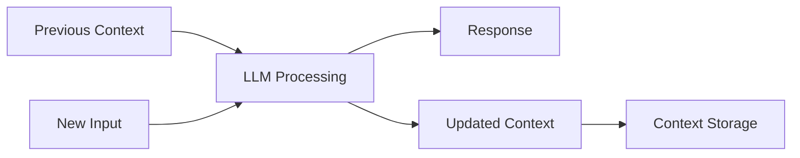
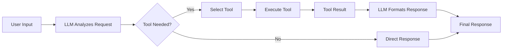
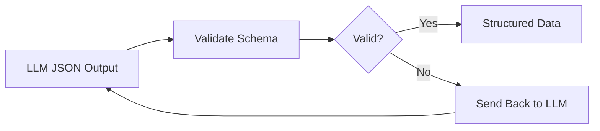
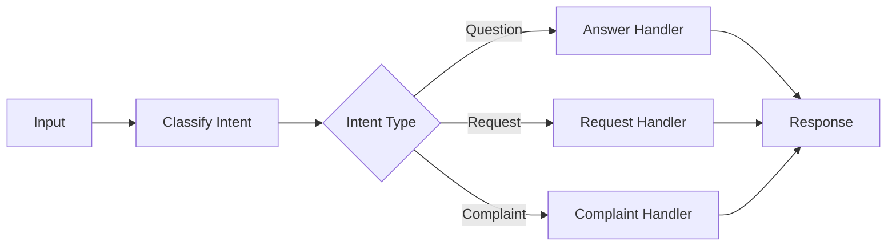
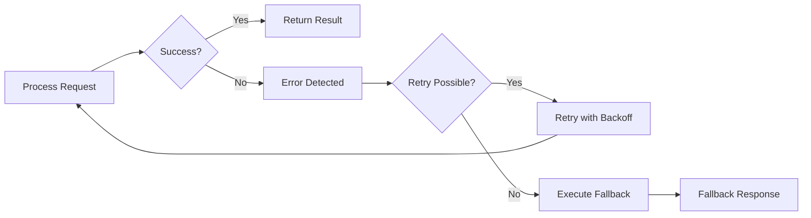
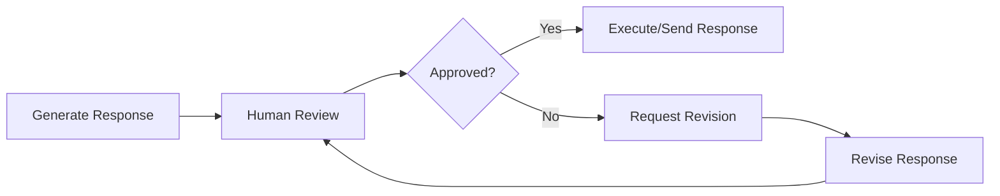

I will be giving a lecture on agentic AI systems to graduate students in a masters of data science program. The students are in their final semester.

I will focus on generative models (primarily LLMs) and provide practical insights on how to successfully build reliable systems with this technology

I would like to use a few key resources as references for these slides:

- <https://www.anthropic.com/engineering/building-effective-agents>
- <https://www.anthropic.com/engineering/multi-agent-research-system>
- <https://minusx.ai/blog/decoding-claude-code/>
- <https://www.philschmid.de/agentic-pattern>
- <https://www.agentrecipes.com/>
- The contents of `<ai-cookbook>` below

Let's research together and collaborate on an outline before trying to write any slides.

My initial thoughts include

- I want to prioritize simplicity. Whenever possible have a single agent. If not possible at least have a single main thread (lead agent) that controls the application
- Modern agents are build on generative models. Generative models are inherently non-deterministic. Requires careful scaffolding to get reliable results
- My definition of agent is an LLM with access to tools running in a loop.
- I would like to work towards having them build a simple agent using each of the architectures we developed. We'll have them do this in plain - Python without abstractions like langchain or other
- Please carefully review all resources, consider my thoughts above, think hard, and propose an outline that we will iterate on. The outline should be a single unordered list -- each top level list item is a slide, max depth 3 to show slide content. each list item (or sub list item) should be 10 words or less

<ai-cookbook>

```txt
Directory structure:
└── daveebbelaar-ai-cookbook/
    └── agents/
        └── building-blocks/
            ├── README.md
            ├── 1-intelligence.py
            ├── 2-memory.py
            ├── 3-tools.py
            ├── 4-validation.py
            ├── 5-control.py
            ├── 6-recovery.py
            ├── 7-feedback.py
            └── requirements.txt


Files Content:

================================================
FILE: agents/building-blocks/README.md
================================================
# The 7 Foundational Building Blocks of AI Agents

## What I Learned Building Real AI Applications

Here's what I've observed after trying countless agent frameworks and talking to developers building real AI products: **the frameworks aren't being used in production**.

Most successful AI applications I've seen are built with custom building blocks, not frameworks. This is because most effective "AI agents" aren't actually that agentic at all. They're mostly deterministic software with strategic LLM calls placed exactly where they add value.

The problem is that most frameworks push the "give an LLM some tools and let it figure everything out" approach. But in reality, you don't want your LLM making every decision. You want it handling the one thing it's good at - reasoning with context - while your code handles everything else.

**The solution is simpler than most frameworks make it seem.** Here's the approach that actually works:

- Break down what you're actually building into fundamental components
- Solve each problem with proper software engineering best practices
- **ONLY INCLUDE AN LLM STEP** when it's impossible to solve with deterministic code

Making an LLM API call is the most expensive and most dangerous operation in modern software development. While incredibly powerful, you want to avoid it at all costs and only use it when absolutely necessary.

This is especially true for background automation systems. There's a huge difference between building personal assistants (like ChatGPT, Cursor) where users are in the loop, versus building fully automated systems that process information or handle workflows without human intervention. Most of you aren't building the next ChatGPT - you're building background automations to make your work or company more efficient.

**But when you do make that LLM call, it's all about context engineering.** To get a good answer back, you need the right context at the right time sent to the right model. You need to pre-process all available information, prompts, and user input so the LLM can easily and reliably solve the problem. This is the most fundamental skill in working with LLMs.

AI agents are simply workflows - directed acyclic graphs (DAGs) if you're being precise, or just graphs if you include loops. Most steps in these workflows should be regular code - not LLM calls.

## The 7 Building Blocks

Given all of this, you only need these seven core building blocks to solve almost any business problem. Take your big problem, break it down into smaller problems, then solve each one using these building blocks chained together - that's how you build effective AI agents.

These are the fundamental primitives. But how do you actually combine them? That's where [workflow orchestration](https://github.com/daveebbelaar/ai-cookbook/tree/main/patterns/workflows) comes in - prompt chaining, routing, reflection, and other agentic patterns that emerge when you combine these building blocks strategically.

### 1. Intelligence
**The only truly "AI" component**

This is where the magic happens - and it's surprisingly simple. You send text to an LLM, it thinks about it, and sends text back. That's it. **Without this, you just have regular software.** The tricky part isn't the LLM call itself - it's everything else you need to build around it.


### 2. Memory
**Context persistence across interactions**

LLMs don't remember anything from previous messages. **Without memory, each interaction starts from scratch** because LLMs are stateless. So you need to manually pass in the conversation history each time. This is just *storing and passing conversation state* - something we've been doing in web apps forever.



### 3. Tools
**External system integration capabilities**

Most of the time you need your LLM to actually do stuff, not just chat. **Pure text generation is limited** - you want to call APIs, update databases, or read files. Tools let the LLM say "I need to call this function with these parameters" and your code handles the actual execution. This is just *normal API integration* where the LLM picks what to call and provides JSON input for the arguments.



### 4. Validation
**Quality assurance and structured data enforcement**

You need to make sure the LLM returns JSON that matches your expected schema. **LLMs are probabilistic and can produce inconsistent outputs**, so you validate the JSON output against a predefined structure. If validation fails, you can send it back to the LLM to fix it. This ensures downstream code can reliably work with the data. This is just *normal schema validation* with retry logic using tools like Pydantic, Zod, or data classes.



### 5. Control
**Deterministic decision-making and process flow**

You don't want your LLM making every decision - some things should be handled by regular code. Use if/else statements, switch cases, and routing logic to direct flow based on conditions. This is just *normal business logic and routing* that you'd write in any application.



### 6. Recovery
**Graceful failure management**

**Things will go wrong** - APIs will be down, LLMs will return nonsense, rate limits will hit you. You need try/catch blocks, retry logic with backoff, and fallback responses when stuff breaks. This is just *standard error handling* that you'd implement in any production system.



### 7. Feedback
**Human oversight and approval workflows**

Sometimes you need a human to check the LLM's work before it goes live. **Some decisions are too important or complex for full automation** - like sending emails to customers or making purchases. Add approval steps where humans can review and approve/reject before execution. This is just *basic approval workflows* like you'd build for any app.




================================================
FILE: agents/building-blocks/1-intelligence.py
================================================
"""
Intelligence: The "brain" that processes information and makes decisions using LLMs.
This component handles context understanding, instruction following, and response generation.

More info: https://platform.openai.com/docs/guides/text?api-mode=responses
"""

from openai import OpenAI


def basic_intelligence(prompt: str) -> str:
    client = OpenAI()
    response = client.responses.create(model="gpt-4o", input=prompt)
    return response.output_text


if __name__ == "__main__":
    result = basic_intelligence(prompt="What is artificial intelligence?")
    print("Basic Intelligence Output:")
    print(result)


================================================
FILE: agents/building-blocks/2-memory.py
================================================
"""
Memory: Stores and retrieves relevant information across interactions.
This component maintains conversation history and context to enable coherent multi-turn interactions.

More info: https://platform.openai.com/docs/guides/conversation-state?api-mode=responses
"""

from openai import OpenAI

client = OpenAI()


def ask_joke_without_memory():
    response = client.responses.create(
        model="gpt-4o-mini",
        input=[
            {"role": "user", "content": "Tell me a joke about programming"},
        ],
    )
    return response.output_text


def ask_followup_without_memory():
    response = client.responses.create(
        model="gpt-4o-mini",
        input=[
            {"role": "user", "content": "What was my previous question?"},
        ],
    )
    return response.output_text


def ask_followup_with_memory(joke_response: str):
    response = client.responses.create(
        model="gpt-4o-mini",
        input=[
            {"role": "user", "content": "Tell me a joke about programming"},
            {"role": "assistant", "content": joke_response},
            {"role": "user", "content": "What was my previous question?"},
        ],
    )
    return response.output_text


if __name__ == "__main__":
    # First: Ask for a joke
    joke_response = ask_joke_without_memory()
    print(joke_response, "\n")

    # Second: Ask follow-up without memory (AI will be confused)
    confused_response = ask_followup_without_memory()
    print(confused_response, "\n")

    # Third: Ask follow-up with memory (AI will remember)
    memory_response = ask_followup_with_memory(joke_response)
    print(memory_response)


================================================
FILE: agents/building-blocks/3-tools.py
================================================
"""
Tools: Enables agents to execute specific actions in external systems.
This component provides the capability to make API calls, database updates, file operations, and other practical actions.


More info: https://platform.openai.com/docs/guides/function-calling?api-mode=responses
"""

import json
import requests
from openai import OpenAI


def get_weather(latitude, longitude):
    response = requests.get(
        f"https://api.open-meteo.com/v1/forecast?latitude={latitude}&longitude={longitude}&current=temperature_2m,wind_speed_10m"
    )
    data = response.json()
    return data["current"]["temperature_2m"]


def call_function(name, args):
    if name == "get_weather":
        return get_weather(**args)
    raise ValueError(f"Unknown function: {name}")


def intelligence_with_tools(prompt: str) -> str:
    client = OpenAI()

    tools = [
        {
            "type": "function",
            "name": "get_weather",
            "description": "Get current temperature for provided coordinates in celsius.",
            "parameters": {
                "type": "object",
                "properties": {
                    "latitude": {"type": "number"},
                    "longitude": {"type": "number"},
                },
                "required": ["latitude", "longitude"],
                "additionalProperties": False,
            },
            "strict": True,
        }
    ]

    input_messages = [{"role": "user", "content": prompt}]

    # Step 1: Call model with tools
    response = client.responses.create(
        model="gpt-4o",
        input=input_messages,
        tools=tools,
    )

    # Step 2: Handle function calls
    for tool_call in response.output:
        if tool_call.type == "function_call":
            # Step 3: Execute function
            name = tool_call.name
            args = json.loads(tool_call.arguments)
            result = call_function(name, args)

            # Step 4: Append function call and result to messages
            input_messages.append(tool_call)
            input_messages.append(
                {
                    "type": "function_call_output",
                    "call_id": tool_call.call_id,
                    "output": str(result),
                }
            )

    # Step 5: Get final response with function results
    final_response = client.responses.create(
        model="gpt-4o",
        input=input_messages,
        tools=tools,
    )

    return final_response.output_text


if __name__ == "__main__":
    result = intelligence_with_tools(prompt="What's the weather like in Paris today?")
    print("Tool Calling Output:")
    print(result)


================================================
FILE: agents/building-blocks/4-validation.py
================================================
"""
Validation: Ensures LLM outputs match predefined data schemas.
This component provides schema validation and structured data parsing to guarantee consistent data formats for downstream code.

More info: https://platform.openai.com/docs/guides/structured-outputs?api-mode=responses
"""

from openai import OpenAI
from pydantic import BaseModel


class TaskResult(BaseModel):
    """
    More info: https://docs.pydantic.dev
    """

    task: str
    completed: bool
    priority: int


def structured_intelligence(prompt: str) -> TaskResult:
    client = OpenAI()
    response = client.responses.parse(
        model="gpt-4o",
        input=[
            {
                "role": "system",
                "content": "Extract task information from the user input.",
            },
            {"role": "user", "content": prompt},
        ],
        text_format=TaskResult,
    )
    return response.output_parsed


if __name__ == "__main__":
    result = structured_intelligence(
        "I need to complete the project presentation by Friday, it's high priority"
    )
    print("Structured Output:")
    print(result.model_dump_json(indent=2))
    print(f"Extracted task: {result.task}")


================================================
FILE: agents/building-blocks/5-control.py
================================================
"""
Control: Provides deterministic decision-making and process flow control.
This component handles if/then logic, routing based on conditions, and process orchestration for predictable behavior.
"""

from openai import OpenAI
from pydantic import BaseModel
from typing import Literal


class IntentClassification(BaseModel):
    intent: Literal["question", "request", "complaint"]
    confidence: float
    reasoning: str


def route_based_on_intent(user_input: str) -> tuple[str, IntentClassification]:
    client = OpenAI()
    response = client.responses.parse(
        model="gpt-4o",
        input=[
            {
                "role": "system",
                "content": "Classify user input into one of three categories: question, request, or complaint. Provide your reasoning and confidence level.",
            },
            {"role": "user", "content": user_input},
        ],
        text_format=IntentClassification,
    )

    classification = response.output_parsed
    intent = classification.intent

    if intent == "question":
        result = answer_question(user_input)
    elif intent == "request":
        result = process_request(user_input)
    elif intent == "complaint":
        result = handle_complaint(user_input)
    else:
        result = "I'm not sure how to help with that."

    return result, classification


def answer_question(question: str) -> str:
    client = OpenAI()
    response = client.responses.create(
        model="gpt-4o", input=f"Answer this question: {question}"
    )
    return response.output[0].content[0].text


def process_request(request: str) -> str:
    return f"Processing your request: {request}"


def handle_complaint(complaint: str) -> str:
    return f"I understand your concern about: {complaint}. Let me escalate this."


if __name__ == "__main__":
    # Test different types of inputs
    test_inputs = [
        "What is machine learning?",
        "Please schedule a meeting for tomorrow",
        "I'm unhappy with the service quality",
    ]

    for user_input in test_inputs:
        print(f"\nInput: {user_input}")
        result, classification = route_based_on_intent(user_input)
        print(
            f"Intent: {classification.intent} (confidence: {classification.confidence})"
        )
        print(f"Reasoning: {classification.reasoning}")
        print(f"Response: {result}")


================================================
FILE: agents/building-blocks/6-recovery.py
================================================
"""
Recovery: Manages failures and exceptions gracefully in agent workflows.
This component implements retry logic, fallback processes, and error handling to ensure system resilience.
"""

from typing import Optional
from openai import OpenAI
from pydantic import BaseModel


class UserInfo(BaseModel):
    name: str
    email: str
    age: Optional[int] = None  # Optional field


def resilient_intelligence(prompt: str) -> str:
    client = OpenAI()

    # Get structured output
    response = client.responses.parse(
        model="gpt-4o",
        input=[
            {"role": "system", "content": "Extract user information from the text."},
            {"role": "user", "content": prompt},
        ],
        text_format=UserInfo,
        temperature=0.0,
    )

    user_data = response.output_parsed.model_dump()

    try:
        # Try to access age field and check if it's valid
        age = user_data["age"]
        if age is None:
            raise ValueError("Age is None")
        age_info = f"User is {age} years old"
        return age_info

    except (KeyError, TypeError, ValueError):
        print("❌ Age not available, using fallback info...")

        # Fallback to available information
        return f"User {user_data['name']} has email {user_data['email']}"


if __name__ == "__main__":
    result = resilient_intelligence(
        "My name is John Smith and my email is john@example.com"
    )
    print("Recovery Output:")
    print(result)


================================================
FILE: agents/building-blocks/7-feedback.py
================================================
"""
Feedback: Provides strategic points where human judgement is required.
This component implements approval workflows and human-in-the-loop processes for high-risk decisions or complex judgments.
"""

from openai import OpenAI


def get_human_approval(content: str) -> bool:
    print(f"Generated content:\n{content}\n")
    response = input("Approve this? (y/n): ")
    return response.lower().startswith("y")


def intelligence_with_human_feedback(prompt: str) -> None:
    client = OpenAI()

    response = client.responses.create(model="gpt-4o", input=prompt)
    draft_response = response.output_text

    if get_human_approval(draft_response):
        print("Final answer approved")
    else:
        print("Answer not approved")


if __name__ == "__main__":
    intelligence_with_human_feedback("Write a short poem about technology")


</ai-cookbook>
