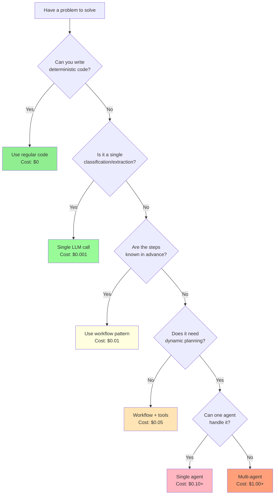

# Building Reliable Agentic AI Systems

From Theory to Production

<div class="text-gray-500 mt-8">
Spencer Lyon <br />
CAP-6942: Capstone<br/>
University of Central Florida
</div>

<div @click="$slidev.nav.next" class="mt-12 py-1 cursor-pointer" hover:bg="white op-10">
  Press Space for next page <carbon:arrow-right />
</div>

<!--
Welcome to our lecture on building reliable agentic AI systems. Today we'll focus on practical insights from real production systems, not just theoretical concepts.
-->

---

# What is an Agent?

<div class="text-4xl mt-8">
  <span class="text-blue-500">LLM</span> +
  <span class="text-green-500">Tools</span> +
  <span class="text-purple-500">Loop</span>
</div>

<div class="mt-8 text-xl text-gray-400">
Not chatbots, but autonomous systems<br/>
Simple definition beats complex abstractions
</div>

<!--
An agent is fundamentally just three things combined: an LLM for reasoning, tools to interact with the world, and a loop to keep it running. That's it. Don't overcomplicate it.
-->

---

# The Cost of Intelligence

<div class="grid grid-cols-3 gap-6 mt-8">
  <div class="p-4 bg-red-500 bg-opacity-10 rounded">
    <h3 class="text-red-500 text-2xl mb-2">💸 Cost</h3>
    <div class="text-lg font-mono">
      GPT-4o: ~$5/M tokens<br/>
      1000 calls/day = $150/mo<br/>
      <span class="text-sm text-gray-400">Adds up fast at scale</span>
    </div>
  </div>

  <div class="p-4 bg-orange-500 bg-opacity-10 rounded">
    <h3 class="text-orange-500 text-2xl mb-2">⏱️ Latency</h3>
    <div class="text-lg font-mono">
      First token: 200-500ms<br/>
      Full response: 2-10s<br/>
      <span class="text-sm text-gray-400">100x slower than DB query</span>
    </div>
  </div>

  <div class="p-4 bg-yellow-500 bg-opacity-10 rounded">
    <h3 class="text-yellow-500 text-2xl mb-2">🎲 Variance</h3>
    <div class="text-lg font-mono">
      Same input → Different output<br/>
      Format changes randomly<br/>
      <span class="text-sm text-gray-400">Even at temperature=0</span>
    </div>
  </div>
</div>

<div class="mt-8 p-4 bg-purple-500 bg-opacity-10 rounded text-center">
  <div class="text-xl font-bold">"Making an LLM API call is the most expensive and dangerous operation in modern software"</div>
  <div class="text-sm text-gray-400 mt-2">- Dave Ebbelaar, AI Cookbook</div>
</div>

<!--
This is critical context. Every LLM call costs real money, takes significant time, and produces unpredictable results. This shapes everything about how we build agents.
-->

---

# The Evolution Path

<div class="mt-8">
  <div class="flex items-center justify-between mb-8">
    <div class="text-center flex-1">
      <div class="text-3xl mb-2">📝</div>
      <div class="text-xl font-bold text-blue-500">Deterministic Code</div>
      <div class="text-sm text-gray-400">If/else, rules, algorithms</div>
    </div>
    <div class="text-2xl">→</div>
    <div class="text-center flex-1">
      <div class="text-3xl mb-2">🧠</div>
      <div class="text-xl font-bold text-green-500">Single LLM Call</div>
      <div class="text-sm text-gray-400">Classification, extraction</div>
    </div>
    <div class="text-2xl">→</div>
    <div class="text-center flex-1">
      <div class="text-3xl mb-2">🔄</div>
      <div class="text-xl font-bold text-purple-500">Workflow</div>
      <div class="text-sm text-gray-400">Predefined paths</div>
    </div>
    <div class="text-2xl">→</div>
    <div class="text-center flex-1">
      <div class="text-3xl mb-2">🤖</div>
      <div class="text-xl font-bold text-red-500">Agent</div>
      <div class="text-sm text-gray-400">Autonomous decisions</div>
    </div>
  </div>

  <div class="grid grid-cols-4 gap-4 mt-8">
    <div class="text-center">
      <div class="text-green-500">✅ Fast</div>
      <div class="text-green-500">✅ Cheap</div>
      <div class="text-green-500">✅ Predictable</div>
      <div class="text-red-500">❌ Limited</div>
    </div>
    <div class="text-center">
      <div class="text-green-500">✅ Flexible</div>
      <div class="text-yellow-500">⚠️ Slower</div>
      <div class="text-yellow-500">⚠️ Costs $</div>
      <div class="text-green-500">✅ Handles variety</div>
    </div>
    <div class="text-center">
      <div class="text-green-500">✅ Structured</div>
      <div class="text-green-500">✅ Debuggable</div>
      <div class="text-yellow-500">⚠️ More complex</div>
      <div class="text-green-500">✅ Reliable</div>
    </div>
    <div class="text-center">
      <div class="text-green-500">✅ Autonomous</div>
      <div class="text-red-500">❌ Expensive</div>
      <div class="text-red-500">❌ Slow</div>
      <div class="text-red-500">❌ Unpredictable</div>
    </div>
  </div>
</div>

<div class="mt-8 text-center text-xl text-gray-400">
  Only move right when you've proven the left doesn't work
</div>

<!--
This is the key insight: there's a progression. Most problems don't need agents. Start simple, add complexity only when necessary.
-->

---

# When NOT to Use Agents

<div class="grid grid-cols-2 gap-8 mt-8">
  <div class="p-6 bg-green-500 bg-opacity-10 rounded">
    <h3 class="text-green-500 mb-4">✅ Use Deterministic Code For:</h3>

    - **Known business rules** (if age > 18...)
    - **Mathematical calculations**
    - **Data transformations** (JSON → CSV)
    - **State machines** (order workflows)
    - **Validation logic** (email format)
    - **CRUD operations**

    <div class="mt-4 p-3 bg-gray-800 rounded text-sm">
      <span class="text-gray-400">Example:</span> Payment processing, user authentication, data pipelines
    </div>
  </div>

  <div class="p-6 bg-purple-500 bg-opacity-10 rounded">
    <h3 class="text-purple-500 mb-4">🤖 Use Agents Only For:</h3>

    - **Open-ended problems** (research, analysis)
    - **Creative tasks** (content generation)
    - **Complex reasoning** (multi-step planning)
    - **Natural language understanding**
    - **Dynamic tool selection**
    - **Iterative refinement needed**

    <div class="mt-4 p-3 bg-gray-800 rounded text-sm">
      <span class="text-gray-400">Example:</span> Customer support, code generation, research assistants
    </div>
  </div>
</div>

<div class="mt-8 text-center p-4 bg-yellow-500 bg-opacity-10 rounded">
  💡 **Rule of Thumb**: If you can write it in 100 lines of Python, don't use an agent
</div>

<!--
Most developers jump to agents too quickly. If you can solve it deterministically, you should. Agents are for problems you CAN'T solve with regular code.
-->

---

# The Uncomfortable Truth About Production

<div class="grid grid-cols-2 gap-8 mt-8">
  <div>
    <h3 class="text-blue-500 mb-4">What You See in Tutorials</h3>

    - Complex frameworks everywhere
    - "Autonomous" agents doing everything
    - LangChain, CrewAI, AutoGPT
    - Multi-agent swarms
  </div>

  <div>
    <h3 class="text-red-500 mb-4">What's Actually in Production</h3>

    - Custom building blocks
    - Mostly deterministic code
    - Strategic LLM calls only
    - Simple, debuggable systems
  </div>
</div>

<div class="mt-12 p-4 bg-yellow-500 bg-opacity-10 rounded">
💡 **Key Insight**: Most successful AI applications are built with custom building blocks, not frameworks
</div>

<!--
There's a huge gap between what you see in demos and what actually works in production. The frameworks aren't being used. Teams build custom solutions with simple, composable patterns.
-->

---

# LLM Calls: Expensive and Dangerous

```python
# The most expensive operation in modern software
response = client.chat.completions.create(
    model="gpt-4o",
    messages=[...],
    temperature=0.7  # Probabilistic outputs!
)
```

<div class="grid grid-cols-3 gap-6 mt-8">
  <div class="p-4 bg-red-500 bg-opacity-10 rounded">
    <h4 class="text-red-500">💸 Cost</h4>
    <p class="text-sm mt-2">Every call costs money</p>
  </div>

  <div class="p-4 bg-orange-500 bg-opacity-10 rounded">
    <h4 class="text-orange-500">⏱️ Latency</h4>
    <p class="text-sm mt-2">Seconds, not milliseconds</p>
  </div>

  <div class="p-4 bg-yellow-500 bg-opacity-10 rounded">
    <h4 class="text-yellow-500">🎲 Non-deterministic</h4>
    <p class="text-sm mt-2">Different outputs each time</p>
  </div>
</div>

<div class="mt-8 text-xl text-center text-gray-400">
Only use when deterministic code fails
</div>

<!--
LLM API calls are the most expensive and dangerous operation in modern software. They cost money, they're slow, and they're unpredictable. Use them strategically, not everywhere.
-->

---
layout: two-cols-title
---

:: title ::

# Workflows vs Agents

::left::

<div class="mt-8">
  <h3 class="text-blue-500 mb-4">Workflows</h3>

- **Predefined code paths**
- You control the flow
- LLM makes decisions within constraints
- Predictable and debuggable

```python
# Workflow example
if classify_intent(msg) == "complaint":
    response = handle_complaint(msg)
else:
    response = answer_question(msg)
```

</div>

::right::

<div class="mt-8">
  <h3 class="text-purple-500 mb-4">Agents</h3>

- **LLM controls the process**
- Dynamic decision making
- Can call tools autonomously
- Flexible but unpredictable

  ```python
  # Agent example
  while not done:
      action = llm.decide_action()
      result = execute(action)
      done = llm.is_complete(result)
  ```

</div>

<div class="absolute bottom-4 left-1/2 transform -translate-x-1/2 text-center">
  <div class="text-xl text-gray-400">Start with workflows, evolve to agents when needed</div>
</div>

<!--
Understanding this distinction is crucial. Workflows are predictable - you define the path. Agents are autonomous - the LLM decides. Most production systems start as workflows.
-->

---

# Context Engineering > Prompt Engineering

<div class="grid grid-cols-2 gap-8 mt-8">
  <div>
    <h3 class="text-gray-500 mb-4">Old Way: Prompt Engineering</h3>

```python
prompt = """You are an expert assistant.
Please help the user with their request.
Be concise and helpful."""

response = llm(prompt + user_input)
```

Static, limited, hope for the best
  </div>

  <div>
    <h3 class="text-green-500 mb-4">New Way: Context Engineering</h3>

```python
context = {
    "user_history": get_user_history(),
    "relevant_docs": search(user_input),
    "current_time": datetime.now(),
    "user_preferences": load_preferences()
}

response = llm(build_prompt(context))
```

Dynamic, comprehensive, reliable
  </div>
</div>

<div class="mt-8 text-center text-xl">
  <span class="text-purple-500 font-bold">Quality of context determines success</span>
</div>

<!--
The shift from prompt engineering to context engineering is fundamental. It's not about crafting the perfect prompt - it's about providing the right information at the right time.
-->

---

# Context Engineering: The Right Information

```python
def build_context(user_query: str, session_id: str) -> dict:
    """Gather ALL relevant information for the LLM"""

    return {
        # User context
        "user_profile": load_user_profile(session_id),
        "conversation_history": get_recent_messages(session_id, limit=10),
        "user_preferences": get_preferences(session_id),

        # Domain context
        "relevant_documents": vector_search(user_query, top_k=5),
        "business_rules": load_business_rules(),
        "current_state": get_system_state(),

        # Temporal context
        "timestamp": datetime.now().isoformat(),
        "timezone": get_user_timezone(session_id),
        "business_hours": is_business_hours(),

        # Constraints
        "max_response_length": 500,
        "allowed_actions": get_user_permissions(session_id),
        "compliance_rules": load_compliance_requirements()
    }
```

<div class="mt-6 text-center text-lg text-gray-400">
  More context = Better decisions = Fewer hallucinations
</div>

<!--
Context engineering is about gathering ALL relevant information. The more context you provide, the better the LLM can reason about the problem and provide accurate responses.
-->

---

# Context Engineering: Tool Documentation

<div class="grid grid-cols-2 gap-8 mt-8">
  <div>
    <h3 class="text-red-500 mb-4">❌ Poor Tool Documentation</h3>

```python
tools = [{
    "name": "search",
    "description": "Search for stuff",
    "parameters": {
        "q": {"type": "string"}
    }
}]
```

LLM doesn't know:
- What to search for
- What format to expect
- When to use this tool
- What 'q' means

  </div>

  <div>
    <h3 class="text-green-500 mb-4">✅ Rich Tool Documentation</h3>

```python
tools = [{
    "name": "search_knowledge_base",
    "description": """Search internal docs.
    Use for: technical questions, policies
    Returns: Top 5 relevant documents
    Example: 'error handling python'""",
    "parameters": {
        "query": {
            "type": "string",
            "description": "Search terms",
            "examples": ["API error", "login"]
        },
        "doc_type": {
            "type": "string",
            "enum": ["policy", "technical", "faq"],
            "description": "Filter by type"
        }
    }
}]
```

  </div>
</div>

<div class="mt-8 p-4 bg-blue-500 bg-opacity-10 rounded text-center">
  💡 **Key Insight**: LLMs perform better with detailed tool documentation - treat them like new developers
</div>

<!--
Tool documentation is critical. The LLM needs to understand not just what a tool does, but when to use it, what to expect, and how to format inputs. Think of it as onboarding a new developer.
-->

---

# The 7 Fundamental Building Blocks

<div class="grid grid-cols-2 gap-4 mt-6">
  <div class="p-4 bg-red-500 bg-opacity-10 rounded">
    <h3 class="text-red-500">1. Control 🚦</h3>
    <p class="text-sm">Deterministic routing (use first!)</p>
    <p class="text-xs text-green-400 mt-1">💰 Free | ⚡ Instant</p>
  </div>

  <div class="p-4 bg-yellow-500 bg-opacity-10 rounded">
    <h3 class="text-yellow-500">2. Validation ✓</h3>
    <p class="text-sm">Structured output enforcement</p>
    <p class="text-xs text-green-400 mt-1">💰 Cheap | ⚡ Fast</p>
  </div>

  <div class="p-4 bg-orange-500 bg-opacity-10 rounded">
    <h3 class="text-orange-500">3. Recovery 🔄</h3>
    <p class="text-sm">Error handling and retries</p>
    <p class="text-xs text-green-400 mt-1">💰 Free | ⚡ Instant</p>
  </div>

  <div class="p-4 bg-green-500 bg-opacity-10 rounded">
    <h3 class="text-green-500">4. Memory 💾</h3>
    <p class="text-sm">Conversation state persistence</p>
    <p class="text-xs text-yellow-400 mt-1">💰 Storage cost | ⚡ Fast</p>
  </div>

  <div class="p-4 bg-indigo-500 bg-opacity-10 rounded">
    <h3 class="text-indigo-500">5. Feedback 👤</h3>
    <p class="text-sm">Human oversight workflows</p>
    <p class="text-xs text-yellow-400 mt-1">💰 Human time | ⚡ Variable</p>
  </div>

  <div class="p-4 bg-purple-500 bg-opacity-10 rounded">
    <h3 class="text-purple-500">6. Tools 🔧</h3>
    <p class="text-sm">External system integrations</p>
    <p class="text-xs text-orange-400 mt-1">💰 API costs | ⚡ Network latency</p>
  </div>

  <div class="p-4 bg-blue-500 bg-opacity-10 rounded">
    <h3 class="text-blue-500">7. Intelligence 🧠</h3>
    <p class="text-sm">LLM processing (use last!)</p>
    <p class="text-xs text-red-400 mt-1">💰 Expensive | ⚡ Slow (2-10s)</p>
  </div>
</div>

<div class="mt-6 text-center text-gray-400">
  Start with cheap/fast blocks → Add expensive blocks only when needed
</div>

<!--
Notice the reordering: Control comes first (it's free!), Intelligence comes last (it's expensive!). This reflects the reality of building production systems - exhaust deterministic options before using LLMs.
-->

---

# Building Block 1: Control (Start Here!)

```python
def route_request(user_input: str):
    """Deterministic routing - don't let LLM decide everything"""

    # Use LLM ONLY for classification
    intent = classify_intent(user_input)

    # Regular code handles ALL routing logic
    if intent == "complaint":
        return handle_complaint(user_input)
    elif intent == "technical":
        return technical_support(user_input)
    elif intent == "billing":
        return billing_system(user_input)
    else:
        return general_response(user_input)
```

<div class="grid grid-cols-2 gap-8 mt-8">
  <div class="text-green-500">
    ✅ **Use LLMs for**: Classification, understanding intent
  </div>
  <div class="text-red-500">
    ❌ **Use code for**: Routing, business logic, control flow
  </div>
</div>

<div class="mt-6 p-3 bg-blue-500 bg-opacity-10 rounded text-center">
  💡 **90% of "AI" logic should be regular code** - LLMs are just for the 10% you can't code
</div>

<!--
Control is your first building block because it's free and deterministic. Use regular code for everything you can. Only use LLMs for what code can't handle - like understanding natural language.
-->

---

# Building Block 2: Memory

```python
# Without memory - LLM forgets everything
joke = ask_llm("Tell me a joke")
followup = ask_llm("What was my previous question?")  # ❌ No idea!

# With memory - pass conversation history
messages = [
    {"role": "user", "content": "Tell me a joke"},
    {"role": "assistant", "content": joke},
    {"role": "user", "content": "What was my previous question?"}
]
response = client.chat.completions.create(
    model="gpt-4o",
    messages=messages  # ✅ Full context
)
```

<div class="mt-8 text-xl text-center text-gray-400">
  LLMs are stateless - memory is just passing conversation history
</div>

<!--
LLMs don't remember anything between calls. Memory is just manually passing the conversation history each time. It's state management, like in any web app.
-->

---

# Building Block 3: Tools

```python
tools = [{
    "type": "function",
    "function": {
        "name": "get_weather",
        "description": "Get current weather for a location",
        "parameters": {
            "type": "object",
            "properties": {
                "location": {"type": "string"},
                "unit": {"type": "string", "enum": ["celsius", "fahrenheit"]}
            }
        }
    }
}]

# LLM decides: "I need to call get_weather for Paris"
response = client.chat.completions.create(
    model="gpt-4o",
    messages=messages,
    tools=tools
)
```

<div class="mt-6 text-center text-xl">
  Move beyond text generation → Actually do things
</div>

<!--
Tools let your LLM interact with the world - call APIs, query databases, control systems. The LLM decides what to call and provides the arguments.
-->

---

# Building Block 4: Validation

```python
from pydantic import BaseModel

class TaskOutput(BaseModel):
    task: str
    priority: int
    deadline: datetime

# Force structured output
response = client.beta.chat.completions.parse(
    model="gpt-4o",
    messages=messages,
    response_format=TaskOutput  # ✅ Guaranteed structure
)

task = response.parsed  # Type-safe, validated
```

<div class="mt-8 p-4 bg-yellow-500 bg-opacity-10 rounded">
  <h3 class="text-yellow-500">Why This Matters</h3>

- LLMs are probabilistic → outputs vary
- Downstream code needs consistent structure
- Validation + retry = reliability

</div>

<!--
Validation ensures your LLM outputs match expected schemas. This is critical for reliability - you can't build robust systems on unpredictable outputs.
-->

---

# Building Block 5: Control

```python
def route_request(user_input: str):
    """Deterministic routing - don't let LLM decide everything"""

    intent = classify_intent(user_input)  # LLM classifies

    # Regular code handles routing
    if intent == "complaint":
        return handle_complaint(user_input)
    elif intent == "technical":
        return technical_support(user_input)
    else:
        return general_response(user_input)
```

<div class="grid grid-cols-2 gap-8 mt-8">
  <div class="text-green-500">
    ✅ **Use LLMs for**: Classification, understanding intent
  </div>
  <div class="text-red-500">
    ❌ **Use code for**: Routing, business logic, control flow
  </div>
</div>

<!--
You don't want your LLM making every decision. Use it for what it's good at - understanding and classification. Use regular code for control flow.
-->

---

# Building Block 6: Recovery

```python
async def resilient_llm_call(prompt: str, max_retries: int = 3):
    """Things WILL fail - be ready"""

    for attempt in range(max_retries):
        try:
            response = await llm.complete(prompt)
            if validate_response(response):
                return response
        except RateLimitError:
            await asyncio.sleep(2 ** attempt)  # Exponential backoff
        except APIError as e:
            log_error(e)
            if attempt == max_retries - 1:
                return FALLBACK_RESPONSE

    return "I'm having trouble right now. Please try again."
```

<div class="mt-8 text-center">
  <div class="text-2xl text-red-500 mb-4">Things that WILL go wrong:</div>
  <div class="text-lg text-gray-400">APIs down • Rate limits • Nonsense outputs • Timeouts</div>
</div>

<!--
Production systems fail. APIs go down, rate limits hit, LLMs return garbage. Your system must handle these gracefully with retries, fallbacks, and clear error messages.
-->

---

# Building Block 7: Feedback

```python
def process_with_approval(user_request: str):
    """Some decisions need human oversight"""

    # Generate response
    draft = llm.generate_email(user_request)

    # Human review required
    print(f"Draft email:\n{draft}\n")
    approval = input("Send this email? (y/n): ")

    if approval.lower() == 'y':
        send_email(draft)
        return "Email sent successfully"
    else:
        return "Email cancelled by user"
```

<div class="mt-8 p-4 bg-purple-500 bg-opacity-10 rounded">
  <h3 class="text-purple-500 mb-2">When to Add Human Oversight</h3>

- High-stakes decisions (payments, emails to customers)
- Content generation that represents your brand
- Actions that can't be undone
- Complex judgments requiring context

</div>

<!--
Not everything should be fully automated. Some decisions are too important or complex. Build in approval workflows where humans review before execution.
-->

---
layout: center
---

# Common Agentic Patterns

<div class="text-2xl text-gray-400 mt-8">
From simple to complex
</div>

<!--
Now let's look at common patterns built from these blocks. These are proven architectures used in production systems.
-->

---

# Pattern 1: Sequential Workflows

```python
async def sequential_story_generation(topic: str):
    """Each step builds on the previous output"""

    # Step 1: Generate outline
    outline = await generate_outline(topic)

    # Step 2: Validate outline quality
    if not is_quality_outline(outline):
        outline = await improve_outline(outline)

    # Step 3: Write the story
    story = await write_story(outline)

    # Step 4: Polish final output
    final = await polish_story(story)

    return final
```

<div class="mt-8">
  <div class="text-xl mb-4">Use Cases:</div>

- Document generation (reports, articles)
- Data transformation pipelines
- Multi-stage content creation
- Step-by-step problem solving

</div>

<!--
Sequential workflows chain LLM calls where each step processes the output of the previous one. Great for tasks that naturally break down into stages.
-->

---

# Pattern 2: Routing and Handoffs

```python
# Main router agent
router_agent = Agent(
    instructions="Route to the appropriate specialist",
    handoffs=[spanish_agent, french_agent, technical_agent]
)

# Specialized agents
spanish_agent = Agent(
    instructions="You only speak Spanish",
    description="Handles Spanish language requests"
)

technical_agent = Agent(
    instructions="You are a technical expert",
    description="Handles technical questions"
)

# Usage
async def handle_request(message):
    agent = router_agent
    while True:
        result = await agent.run(message)
        if result.handoff:
            agent = result.handoff  # Specialist takes over
        else:
            return result
```

<!--
Routing patterns use a front-line agent to classify and hand off to specialists. The specialist "takes over" the conversation from that point.
-->

---

# Pattern 3: Tool Use

```python
def weather_agent():
    """Agent that can check weather and make recommendations"""

    tools = [
        get_current_weather,
        get_forecast,
        search_activities
    ]

    # User: "Should I go hiking tomorrow in Denver?"

    # Agent thinks: Need weather info first
    weather = get_forecast("Denver", "tomorrow")

    # Agent thinks: Weather looks good, find trails
    trails = search_activities("hiking trails Denver")

    # Agent responds with recommendation
    return f"Tomorrow looks great for hiking! {weather}. Try {trails[0]}"
```

<div class="mt-8 text-center">
  <div class="text-xl text-blue-500">LLM decides which tools + Tool provides real data</div>
  <div class="text-lg text-gray-400 mt-2">= Intelligent actions</div>
</div>

<!--
Tool use patterns let the LLM decide what external resources it needs. It's not just generating text - it's gathering information and taking actions.
-->

---

# Pattern 4: Reflection and Iteration

```python
async def reflective_generation(request: str, max_attempts: int = 5):
    """Generate, evaluate, and improve iteratively"""

    for attempt in range(max_attempts):
        # Generate
        output = await generator_agent.run(request)

        # Evaluate
        evaluation = await evaluator_agent.evaluate(output)

        if evaluation.score >= 0.8:
            return output

        # Provide feedback for next iteration
        request = f"""
        Previous output: {output}
        Feedback: {evaluation.feedback}
        Please improve based on feedback.
        """

    return output  # Return best effort
```

<div class="mt-6 text-center">
  <div class="text-xl">🔄 Generate → Evaluate → Improve → Repeat</div>
</div>

<!--
Reflection patterns use one LLM to evaluate another's output. This self-improvement loop can dramatically increase quality, especially for creative tasks.
-->

---

# Pattern 5: Planning and Decomposition

```python
async def research_with_planning(question: str):
    """Break complex tasks into subtasks"""

    # Step 1: Create research plan
    plan = await planner_agent.create_plan(question)
    # Output: ["Find statistics", "Check recent news", "Analyze trends"]

    # Step 2: Execute each subtask
    results = []
    for task in plan.tasks:
        result = await execute_subtask(task)
        results.append(result)

    # Step 3: Synthesize findings
    answer = await synthesizer_agent.combine(results)

    return answer
```

<div class="mt-8 p-4 bg-green-500 bg-opacity-10 rounded">
  Dynamic planning for complex problems where steps aren't known in advance
</div>

<!--
Planning patterns let the LLM break down complex tasks dynamically. Unlike sequential workflows, the steps aren't predefined - the LLM figures them out.
-->

---

# Pattern 6: Multi-Agent Collaboration

```python
# Only use when truly necessary!
orchestrator = Agent("Coordinate specialized agents")
researcher = Agent("Find and analyze information")
writer = Agent("Create polished content")
reviewer = Agent("Check quality and accuracy")

async def collaborative_report(topic: str):
    # Orchestrator manages the workflow
    research = await researcher.gather_info(topic)
    draft = await writer.create_draft(research)
    feedback = await reviewer.review(draft)
    final = await writer.revise(draft, feedback)

    return final
```

<div class="mt-8 p-4 bg-red-500 bg-opacity-10 rounded">
  ⚠️ **Warning**: Multi-agent systems are complex. Only use when a single agent truly can't handle the task.
</div>

<!--
Multi-agent patterns coordinate specialists for complex tasks. But beware - they're hard to debug and often unnecessary. Start simple.
-->

---

# Lessons from Claude Code: Simplicity Wins

<div class="grid grid-cols-2 gap-8 mt-6">
  <div>
    <h3 class="text-blue-500 mb-4">Architecture Insights</h3>

- Single main thread (not multi-agent chaos)
- Simple tools over complex abstractions
- 50% of calls use cheaper models
- One main loop with sub-agents max depth 1

  </div>

  <div>
    <h3 class="text-green-500 mb-4">Tool Design</h3>

```python
# High-frequency → dedicated tool
tools = [
    Edit(),    # Used constantly
    Read(),    # Used constantly
    Search(),  # Used often
]

# Low-frequency → generic bash
bash("git commit -m 'message'")
```

  </div>
</div>

<div class="mt-8 text-center p-4 bg-purple-500 bg-opacity-10 rounded">
  💡 Resist the urge to over-engineer. Good harness for the model + let it cook!
</div>

<!--
Claude Code is one of the most successful AI coding assistants. Its secret? Radical simplicity. One thread, simple tools, smart use of cheaper models.
-->

---

# Production Realities: Real Numbers

<div class="grid grid-cols-2 gap-8 mt-6">
  <div>
    <h3 class="text-red-500 mb-4">💰 Cost Reality Check</h3>

    ```python
    # Real production costs (per 1000 requests)
    costs = {
        "gpt-4o": 150,        # $0.15 per request
        "gpt-3.5-turbo": 20,  # $0.02 per request
        "claude-3.5": 120,    # $0.12 per request
        "embedding": 0.50,    # $0.0005 per request
    }

    # 10K users, 10 requests/day each
    # = 100K requests/day
    # = $15,000/day with GPT-4o
    # = $2,000/day with GPT-3.5
    ```
  </div>

  <div>
    <h3 class="text-orange-500 mb-4">⏱️ Latency Breakdown</h3>

    ```python
    # Typical response times
    latencies = {
        "network_roundtrip": 50,    # ms
        "first_token": 300,         # ms
        "full_response": 3000,      # ms (3s)
        "tool_call": 100,           # ms
        "total_agent_loop": 5000,   # ms (5s)
    }

    # User tolerance thresholds
    # < 1s: Feels instant
    # 1-3s: Noticeable wait
    # > 5s: Users get frustrated
    # > 10s: Users leave
    ```
  </div>
</div>

<div class="mt-6 p-4 bg-yellow-500 bg-opacity-10 rounded text-center">
  🎯 **Strategy**: Use GPT-4 for complex reasoning, GPT-3.5 for simple tasks, cache aggressively
</div>

<!--
These are real numbers from production systems. Cost and latency compound quickly. You need strategies to manage both.
-->

---

# Production Realities: Debugging Agents

```python
import logging
from datetime import datetime

class DebugAgent:
    def __init__(self, name: str):
        self.name = name
        self.trace = []

    def log_decision(self, decision_type: str, data: dict):
        """Log every decision point for debugging"""
        entry = {
            "timestamp": datetime.now().isoformat(),
            "agent": self.name,
            "decision": decision_type,
            "data": data,
            "context_size": len(str(data))
        }
        self.trace.append(entry)
        logging.info(f"[{self.name}] {decision_type}: {data.get('reason', '')}")

    def export_trace(self) -> str:
        """Export full decision trace for debugging"""
        return json.dumps(self.trace, indent=2)
```

<div class="mt-6">
  <h3 class="text-blue-500 mb-2">Essential Debugging Information:</h3>

  - **Every LLM call** (input, output, tokens used, cost)
  - **Tool calls** (which tool, parameters, results)
  - **Decision points** (why agent chose path A vs B)
  - **Context state** at each step
  - **Timing information** for performance analysis
</div>

<!--
You can't debug what you can't see. Log everything in development, selectively in production. The trace is your lifeline when things go wrong.
-->

---

# Building Without Frameworks

```python
# This is often all you need:
import openai
import json
from typing import Dict, Any

class SimpleAgent:
    def __init__(self, instructions: str):
        self.client = openai.OpenAI()
        self.instructions = instructions
        self.messages = []

    def run(self, user_input: str) -> str:
        self.messages.append({"role": "user", "content": user_input})

        response = self.client.chat.completions.create(
            model="gpt-4o",
            messages=[
                {"role": "system", "content": self.instructions},
                *self.messages
            ]
        )

        assistant_message = response.choices[0].message.content
        self.messages.append({"role": "assistant", "content": assistant_message})

        return assistant_message
```

<div class="mt-6 text-center text-xl text-gray-400">
  Direct API calls = Full control, easy debugging, no magic
</div>

<!--
You don't need LangChain or other frameworks to start. Direct API calls give you full control and understanding of what's happening.
-->

---

# The Framework Tradeoff for Production

<div class="grid grid-cols-2 gap-8 mt-6">
  <div>
    <h3 class="text-red-500 mb-4">Start Raw (Learning/Prototyping)</h3>

    ```python
    # Direct API calls
    response = client.chat.completions.create(...)

    # Manual logging
    print(f"Called LLM: {response}")

    # Simple error handling
    try:
        ...
    except Exception as e:
        print(f"Error: {e}")
    ```

    ✅ Full understanding<br/>
    ✅ Easy debugging<br/>
    ❌ Manual everything
  </div>

  <div>
    <h3 class="text-green-500 mb-4">Add Framework (Production/Scale)</h3>

    ```python
    # Automatic observability
    @trace
    def agent_step():
        # Framework handles:
        # - Distributed tracing
        # - Metrics collection
        # - Log aggregation
        # - Error reporting
        pass
    ```

    ✅ Built-in observability<br/>
    ✅ Production infrastructure<br/>
    ❌ Abstraction overhead
  </div>
</div>

<div class="mt-8 text-center p-4 bg-blue-500 bg-opacity-10 rounded">
  **Key Insight**: Frameworks shine for infrastructure (logging, tracing, monitoring), not agent logic
</div>

<!--
The real value of frameworks isn't in agent logic - it's in production infrastructure. Start raw to understand, adopt frameworks when you need observability at scale.
-->

---

# Error Handling and Recovery

```python
class RobustAgent:
    async def call_with_fallback(self, prompt: str):
        strategies = [
            (self.primary_llm, "gpt-4o"),
            (self.backup_llm, "gpt-3.5-turbo"),
            (self.local_llm, "llama-3"),
            (self.cached_response, None),
            (self.default_response, None)
        ]

        for strategy, model in strategies:
            try:
                return await strategy(prompt, model)
            except Exception as e:
                log_error(f"Failed with {model}: {e}")
                continue

        return "I'm unable to help right now. Please try again later."
```

<div class="mt-8 text-2xl text-center">
  <span class="text-red-500">Expect failure</span> →
  <span class="text-yellow-500">Plan for it</span> →
  <span class="text-green-500">Degrade gracefully</span>
</div>

<!--
Production systems must handle failures gracefully. Have backup models, cached responses, and clear error messages. Users prefer a degraded experience over no experience.
-->

---

# Validation and Guardrails

```python
# Input guardrails
@input_guardrail
async def check_harmful_content(input_text: str):
    if contains_pii(input_text):
        raise ValidationError("Please remove personal information")

    if is_prompt_injection(input_text):
        raise SecurityError("Invalid input detected")

# Output guardrails
@output_guardrail
async def validate_response(output: str):
    if contains_sensitive_data(output):
        return "[REDACTED]"

    if not appropriate_for_audience(output):
        return regenerate_with_constraints(output)

    return output

# Usage
@with_guardrails(input=[check_harmful_content],
                 output=[validate_response])
async def safe_agent_call(user_input: str):
    return await agent.process(user_input)
```

<!--
Guardrails protect your system and users. Input guardrails catch harmful requests. Output guardrails ensure responses are safe and appropriate.
-->

---

# When NOT to Use Agents

<div class="grid grid-cols-2 gap-8 mt-8">
  <div class="p-6 bg-red-500 bg-opacity-10 rounded">
    <h3 class="text-red-500 mb-4">❌ Bad Fit for Agents</h3>

    - Known steps, deterministic process
    - Simple Q&A from documentation
    - Mathematical calculations
    - Data transformations with fixed rules
    - Real-time/low-latency requirements

    <div class="mt-4 text-sm text-gray-400">
      Use regular code or simple LLM calls
    </div>
  </div>

  <div class="p-6 bg-green-500 bg-opacity-10 rounded">
    <h3 class="text-green-500 mb-4">✅ Good Fit for Agents</h3>

    - Complex reasoning required
    - Multiple tools needed dynamically
    - Iterative refinement beneficial
    - Planning required for unknown steps
    - Human-like judgment needed

    <div class="mt-4 text-sm text-gray-400">
      Agents add value here
    </div>
  </div>
</div>

<div class="mt-8 text-center text-xl">
  <span class="text-purple-500">Agents trade latency + cost for capability</span>
</div>

<!--
Not everything needs an agent. They're expensive and slow. Use them when the complexity justifies the cost, not for simple deterministic tasks.
-->

---
layout: center
---

# Start Simple, Iterate Deliberately

<div class="text-6xl mt-8">
  1️⃣ → 🔧 → ♾️
</div>

<div class="grid grid-cols-3 gap-4 mt-8 text-lg">
  <div class="text-center">
    <div class="text-blue-500 font-bold">Single LLM call</div>
    <div class="text-sm text-gray-400">Start here always</div>
  </div>

  <div class="text-center">
    <div class="text-green-500 font-bold">Add tools gradually</div>
    <div class="text-sm text-gray-400">When needed</div>
  </div>

  <div class="text-center">
    <div class="text-purple-500 font-bold">Multi-agent last</div>
    <div class="text-sm text-gray-400">When proven necessary</div>
  </div>
</div>

<div class="mt-12 text-xl text-gray-400 text-center">
  Complexity should be earned, not assumed
</div>

<!--
This is the most important principle. Start with the simplest solution. Add complexity only when you've proven simpler approaches don't work.
-->

---
layout: section
---

# Lab Exercises

<div class="text-2xl text-gray-400 mt-8">
  Let's build some agents!
</div>

<!--
Now we'll put these concepts into practice with hands-on exercises building real agents using the patterns we've discussed.
-->

---

# Lab 1: Start with Workflows (Not Agents!)

```python
# No agent loop - just sequential LLM calls
import openai

def workflow_story_generator(topic: str) -> dict:
    """Workflow: Predefined sequence of LLM calls"""
    client = openai.OpenAI()
    results = {}

    # Step 1: Generate outline (single LLM call)
    outline_response = client.chat.completions.create(
        model="gpt-3.5-turbo",  # Cheaper model for simple task
        messages=[{"role": "user", "content": f"Create outline for story about {topic}"}]
    )
    results['outline'] = outline_response.choices[0].message.content

    # Step 2: Expand to full story (another LLM call)
    story_response = client.chat.completions.create(
        model="gpt-3.5-turbo",
        messages=[{"role": "user", "content": f"Write story from outline: {results['outline']}"}]
    )
    results['story'] = story_response.choices[0].message.content

    return results  # Total cost: ~$0.002

# Usage - NO AGENT, just workflow
story = workflow_story_generator("robot learning to paint")
print(f"Cost: ~$0.002, Time: ~4s")
```

<div class="mt-4 p-3 bg-blue-500 bg-opacity-10 rounded">
💡 **Key Point**: This is a workflow, not an agent. No loop, no autonomy, just predefined steps.
</div>

<!--
Start with workflows! Most "AI" applications are just workflows - predefined sequences of LLM calls. No agent needed.
-->

---

# Lab 1: Parallel Workflows for Speed

```python
import asyncio
from concurrent.futures import ThreadPoolExecutor

async def parallel_workflow(topic: str):
    """Run multiple LLM calls in parallel for speed"""
    client = openai.OpenAI()

    # Define parallel tasks
    async def get_characters():
        return client.chat.completions.create(
            model="gpt-3.5-turbo",
            messages=[{"role": "user", "content": f"List 3 characters for story about {topic}"}]
        )

    async def get_setting():
        return client.chat.completions.create(
            model="gpt-3.5-turbo",
            messages=[{"role": "user", "content": f"Describe setting for story about {topic}"}]
        )

    async def get_plot():
        return client.chat.completions.create(
            model="gpt-3.5-turbo",
            messages=[{"role": "user", "content": f"Create plot for story about {topic}"}]
        )

    # Run in parallel - 3x faster!
    characters, setting, plot = await asyncio.gather(
        get_characters(), get_setting(), get_plot()
    )

    return {
        "characters": characters.choices[0].message.content,
        "setting": setting.choices[0].message.content,
        "plot": plot.choices[0].message.content
    }

# Time: ~2s instead of 6s sequential
```

<!--
Parallel workflows dramatically reduce latency. If tasks are independent, run them simultaneously. Still not an agent - just optimized workflow.
-->

---

# Lab 2: Now Build an Agent (With Loop!)

```python
class SimpleAgent:
    """NOW we have an agent - it has a loop and makes decisions"""

    def __init__(self):
        self.client = openai.OpenAI()
        self.max_iterations = 5

    def run(self, goal: str) -> str:
        """Agent loop - the LLM controls the process"""
        context = {"goal": goal, "progress": []}

        for i in range(self.max_iterations):
            # LLM decides what to do next
            decision = self.client.chat.completions.create(
                model="gpt-3.5-turbo",
                messages=[{
                    "role": "system",
                    "content": "You are solving a task step by step."
                }, {
                    "role": "user",
                    "content": f"Goal: {goal}\nProgress: {context['progress']}\nWhat's next?"
                }]
            )

            next_action = decision.choices[0].message.content

            # Check if done
            if "COMPLETE" in next_action:
                return f"Completed: {context['progress']}"

            # Execute action and continue loop
            context['progress'].append(next_action)

        return f"Max iterations reached: {context['progress']}"

# NOW it's an agent - it has autonomy!
agent = SimpleAgent()
result = agent.run("Plan a birthday party")
```

<!--
THIS is an agent. It has a loop, makes its own decisions, and controls the process. The difference from a workflow is autonomy.
-->

---

# Lab 2: Add Reflection Pattern

```python
class ReflectiveAgent(ConversationAgent):
    """Agent that can evaluate and improve its outputs"""

    def generate_with_reflection(self, task: str, max_iterations: int = 3):
        current_output = None

        for i in range(max_iterations):
            if current_output is None:
                # First attempt
                current_output = self.chat(f"Task: {task}")
            else:
                # Improve based on self-evaluation
                improve_prompt = f"""
                Previous output: {current_output}
                Evaluation: {evaluation}

                Please improve your response based on the evaluation.
                """
                current_output = self.chat(improve_prompt)

            # Self-evaluate
            eval_prompt = f"""
            Evaluate this output for the task '{task}':
            {current_output}

            Rate 1-10 and explain what could be better.
            Format: {{"score": N, "feedback": "..."}}
            """

            evaluation = self.chat(eval_prompt)

            try:
                eval_data = json.loads(evaluation)
                if eval_data.get('score', 0) >= 8:
                    print(f"✅ Accepted after {i+1} iterations")
                    break
            except:
                pass

        return current_output

# Test reflection
reflective = ReflectiveAgent("You are a code reviewer")
code = reflective.generate_with_reflection(
    "Write a Python function to check if a string is a palindrome"
)
print(code)
```

<!--
Reflection dramatically improves quality. The agent evaluates its own work and iterates until it meets quality standards.
-->

---

# Lab 3: Implement Error Recovery

```python
import time
from typing import Optional

class ResilientAgent(ConversationAgent):
    """Agent with comprehensive error handling"""

    def __init__(self, system_prompt: str):
        super().__init__(system_prompt)
        self.fallback_responses = {
            'general': "I'm having trouble processing that request.",
            'rate_limit': "I'm getting too many requests. Please wait a moment.",
            'timeout': "This is taking longer than expected.",
        }

    def chat_with_retry(
        self,
        user_input: str,
        max_retries: int = 3,
        timeout: float = 30.0
    ) -> str:

        last_error = None

        for attempt in range(max_retries):
            try:
                # Simulate timeout handling
                start_time = time.time()

                # Try primary model
                response = self._try_model(user_input, "gpt-4o", timeout)
                if response:
                    return response

            except Exception as e:
                last_error = e
                print(f"Attempt {attempt + 1} failed: {e}")

                # Exponential backoff
                if attempt < max_retries - 1:
                    wait_time = 2 ** attempt
                    print(f"Waiting {wait_time}s before retry...")
                    time.sleep(wait_time)

        # All retries failed - use fallback
        return self._get_fallback(last_error)

    def _try_model(self, input: str, model: str, timeout: float) -> Optional[str]:
        """Try a specific model with timeout"""
        # In production, use asyncio with actual timeout
        try:
            response = self.client.chat.completions.create(
                model=model,
                messages=[
                    {"role": "system", "content": self.system_prompt},
                    {"role": "user", "content": input}
                ],
                timeout=timeout
            )
            return response.choices[0].message.content
        except Exception as e:
            if "rate_limit" in str(e).lower():
                raise Exception("rate_limit")
            raise

    def _get_fallback(self, error: Exception) -> str:
        """Return appropriate fallback response"""
        error_str = str(error).lower()

        if "rate_limit" in error_str:
            return self.fallback_responses['rate_limit']
        elif "timeout" in error_str:
            return self.fallback_responses['timeout']
        else:
            return self.fallback_responses['general']

# Test resilience
resilient = ResilientAgent("You are a helpful assistant")
response = resilient.chat_with_retry("Tell me about machine learning")
print(response)
```

<!--
Production agents must handle failures gracefully. This implementation shows retry logic, exponential backoff, and fallback responses.
-->

---

# Lab 3: Add Human Feedback

```python
class SupervisedAgent(ConversationAgent):
    """Agent with human-in-the-loop feedback"""

    def __init__(self, system_prompt: str, require_approval: bool = False):
        super().__init__(system_prompt)
        self.require_approval = require_approval
        self.feedback_history = []

    def chat_with_feedback(self, user_input: str) -> str:
        # Generate initial response
        response = self.chat(user_input)

        # Check if approval required
        if self.require_approval:
            response = self._get_approval(response, user_input)

        return response

    def _get_approval(self, response: str, original_input: str) -> str:
        """Get human approval before finalizing"""
        print("\n" + "="*50)
        print("DRAFT RESPONSE:")
        print(response)
        print("="*50)

        while True:
            feedback = input("\n[A]pprove, [R]evise, or [C]ancel? ").lower()

            if feedback == 'a':
                print("✅ Response approved")
                return response

            elif feedback == 'r':
                revision_request = input("What should be changed? ")
                self.feedback_history.append({
                    'original': response,
                    'feedback': revision_request
                })

                # Generate revised response
                revision_prompt = f"""
                Original request: {original_input}
                Draft response: {response}
                Feedback: {revision_request}

                Please revise the response based on the feedback.
                """
                response = self.chat(revision_prompt)
                print("\n🔄 Revised response generated")

            elif feedback == 'c':
                return "Request cancelled by user."

    def show_feedback_stats(self):
        """Display feedback statistics"""
        if not self.feedback_history:
            print("No feedback collected yet")
            return

        print(f"\nFeedback Statistics:")
        print(f"Total revisions: {len(self.feedback_history)}")

        # Analyze common feedback themes
        common_feedback = {}
        for item in self.feedback_history:
            words = item['feedback'].lower().split()
            for word in words:
                common_feedback[word] = common_feedback.get(word, 0) + 1

        print("Common feedback terms:", dict(sorted(
            common_feedback.items(),
            key=lambda x: x[1],
            reverse=True
        )[:5]))

# Test supervised agent
supervised = SupervisedAgent(
    "You are writing professional emails",
    require_approval=True
)

# Simulate email generation
email = supervised.chat_with_feedback(
    "Write an email declining a meeting invitation politely"
)
print("\nFinal email:", email)

supervised.show_feedback_stats()
```

<!--
Human feedback is crucial for high-stakes outputs. This pattern allows review and revision before any action is taken.
-->

---

# Decision Flowchart: Do You Need an Agent?



<div class="mt-6 text-center text-lg text-gray-400">
  Start at the top, only move down when necessary
</div>

<!--
This flowchart is your decision guide. Always start with the simplest solution. Each step down adds cost and complexity.
-->

---
layout: center
---

# Key Takeaways

<div class="grid grid-cols-2 gap-8 mt-8">
  <div class="space-y-4">
    <div class="flex items-start gap-3">
      <span class="text-2xl">1️⃣</span>
      <div>
        <div class="font-bold">Start simple</div>
        <div class="text-sm text-gray-400">Single LLM call → Add complexity only when proven necessary</div>
      </div>
    </div>

    <div class="flex items-start gap-3">
      <span class="text-2xl">2️⃣</span>
      <div>
        <div class="font-bold">Context > Prompts</div>
        <div class="text-sm text-gray-400">Quality of context determines success</div>
      </div>
    </div>

    <div class="flex items-start gap-3">
      <span class="text-2xl">3️⃣</span>
      <div>
        <div class="font-bold">Build blocks, not monoliths</div>
        <div class="text-sm text-gray-400">7 primitives combine into any pattern</div>
      </div>
    </div>
  </div>

  <div class="space-y-4">
    <div class="flex items-start gap-3">
      <span class="text-2xl">4️⃣</span>
      <div>
        <div class="font-bold">Expect failure</div>
        <div class="text-sm text-gray-400">Robust error handling is not optional</div>
      </div>
    </div>

    <div class="flex items-start gap-3">
      <span class="text-2xl">5️⃣</span>
      <div>
        <div class="font-bold">Use frameworks wisely</div>
        <div class="text-sm text-gray-400">For observability, not agent logic</div>
      </div>
    </div>

    <div class="flex items-start gap-3">
      <span class="text-2xl">6️⃣</span>
      <div>
        <div class="font-bold">Simplicity wins</div>
        <div class="text-sm text-gray-400">Claude Code proves this daily</div>
      </div>
    </div>
  </div>
</div>

<!--
These are the key principles to remember. Start simple, focus on context, build with composable blocks, handle failures, and resist unnecessary complexity.
-->

---
layout: section
---

# Resources

<div class="mt-8 space-y-3 text-lg">

📚 **Essential Reading**

- [Building Effective Agents](https://anthropic.com/engineering/building-effective-agents) - Anthropic
- [Multi-Agent Research System](https://anthropic.com/engineering/multi-agent-research-system) - Anthropic
- [Claude Code Analysis](https://minusx.ai/blog/decoding-claude-code/) - MinusX
- [Agentic Patterns](https://www.philschmid.de/agentic-pattern) - Phil Schmid

🔧 **Code Examples**

- [Building Blocks Repository](https://github.com/daveebbelaar/ai-cookbook/tree/main/agents/building-blocks)
- [OpenAI Agent Patterns](https://github.com/openai/openai-agents-python)
- [Agent Recipes](https://www.agentrecipes.com/)

💬 **Community**

- [Claude Developers Discord](https://discord.gg/claude)
- [r/LocalLLaMA](https://reddit.com/r/LocalLLaMA)

</div>

<!--
Here are the key resources for diving deeper. Start with Anthropic's articles - they're based on real production experience.
-->

---
layout: center
class: text-center
---

# Questions?

<div class="mt-8 text-xl text-gray-400">
Let's discuss what you're building
</div>

<div class="mt-12 text-sm text-gray-500">
Contact: [your contact info]<br/>
Slides: [repository link]
</div>

<!--
Thank you for your attention. I'm excited to hear about what you're planning to build with these concepts.
-->
