# Building Reliable Agentic AI Systems

From Theory to Production

**Spencer Lyon**
CAP-6942: Capstone
University of Central Florida

:: note ::

Press Space for next page →

<!--
Welcome to our lecture on building reliable agentic AI systems. Today we'll focus on practical insights from real production systems, not just theoretical concepts.
-->

---
layout: top-title
color: blue-light
---

:: title ::

# Today's Journey

:: content ::

<div class="grid grid-cols-4 gap-8 mt-12">
  <div class="text-center" v-click>
    <div class="text-4xl mb-4">🎯</div>
    <div class="text-xl font-bold text-blue-400">Background</div>
    <div class="text-sm text-gray-400 mt-2">How to work with LLMs?<br/>What are agents?<br/>Why now?</div>
  </div>

  <div class="text-center" v-click>
    <div class="text-4xl mb-4">🧠</div>
    <div class="text-xl font-bold text-green-400">Principles</div>
    <div class="text-sm text-gray-400 mt-2">Building blocks<br/>Core concepts</div>
  </div>

  <div class="text-center" v-click>
    <div class="text-4xl mb-4">🔄</div>
    <div class="text-xl font-bold text-purple-400">Patterns</div>
    <div class="text-sm text-gray-400 mt-2">6 proven architectures<br/>When to use each</div>
  </div>

  <div class="text-center" v-click>
    <div class="text-4xl mb-4">⚡</div>
    <div class="text-xl font-bold text-red-400">Practice</div>
    <div class="text-sm text-gray-400 mt-2">Real implementation<br/>Production tips</div>
  </div>
</div>

<div class="text-center mt-12 text-gray-400" v-click>
From theory to production-ready systems
</div>

<!--
Today we'll cover four main areas. First, we'll establish the background - understanding what agents really are and why they're suddenly everywhere. Then we'll dive into the fundamental principles and building blocks that make agents work. Next, we'll explore six proven patterns that have emerged from real production systems. Finally, we'll put it all into practice with actual implementation strategies. The goal is to give you practical, production-ready knowledge, not just theory.
-->

---
layout: section
color: blue-light
---

# Background

Foundational concepts

<!--
Let's get started with some background knowledge/info
-->

---
layout: top-title
color: blue-light
---

:: title ::

# The Foundation: Generative AI

:: content ::

<v-clicks>

- **Modern agents are built on generative models**
  - Primarily Large Language Models (LLMs)
  - Powerful reasoning and generation capabilities

- **Generative models are inherently non-deterministic**
  - Same input → Different outputs
  - Probabilistic, not deterministic like traditional code

- **Requires careful scaffolding for reliable results**
  - Can't just "let it run wild"
  - Need structure, validation, and control

</v-clicks>

<!--
This is the fundamental challenge we face: building reliable systems on top of inherently unreliable components. It's like building a precision watch using parts that behave slightly differently each time.
-->

---
layout: top-title
color: blue-light
---

:: title ::

# The Big Three: LLM Task Alignment (background)

:: content ::

<div class="flex justify-center items-center mt-8">
  <div class="relative">
    <svg width="400" height="350" viewBox="0 0 400 350">
      <circle cx="150" cy="130" r="100" fill="#3B82F6" opacity="0.3" stroke="#3B82F6" stroke-width="2"/>
      <circle cx="250" cy="130" r="100" fill="#10B981" opacity="0.3" stroke="#10B981" stroke-width="2"/>
      <circle cx="200" cy="210" r="100" fill="#8B5CF6" opacity="0.3" stroke="#8B5CF6" stroke-width="2"/>
      <text x="105" y="115" text-anchor="middle" font-size="6" font-weight="bold" fill="#1E40AF">Prompt</text>
      <text x="300" y="115" text-anchor="middle" font-size="6" font-weight="bold" fill="#047857">Context</text>
      <text x="200" y="270" text-anchor="middle" font-size="6" font-weight="bold" fill="#6B21A8">Tools</text>
      <text x="200" y="155" text-anchor="middle" font-size="6" font-weight="bold" fill="#111">LLM</text>
      <text x="200" y="175" text-anchor="middle" font-size="6" fill="#111">Power</text>
    </svg>
  </div>
</div>

<div class="text-center mt-4 text-lg text-gray-600">
  <strong>All three must align</strong> • Model intelligence determines reach<br/>
  But direction is <em>always</em> governed by these three
</div>

<!--
The Big Three concept: Every LLM interaction is governed by these three elements. They must work in harmony. The model's intelligence determines how far you can go, but the direction is always set by prompt, context, and tools.
-->

---
layout: top-title-two-cols
color: blue-light
columns: is-4
---

:: title ::

# The Big Three: 1️⃣ Prompt

:: left ::

<Admonition title="Instructions to LLM" color="blue-light" width="100%">

**Core Components:**

- Role/Persona
- Task overview
- Desired output
- Verification strategy
- Process steps

</Admonition>

:: right ::

**Example Prompt Structure:**

```python
prompt = """
You are an expert data analyst.

Task: Analyze customer feedback
Output: JSON summary report
Process:
1. Extract key themes
2. Calculate sentiment
3. Identify action items

Verify: Ensure all feedback
is categorized before output.
"""
```

<div class="mt-4 text-sm text-gray-500">
The prompt is your steering wheel - it sets direction but doesn't provide the fuel
</div>

<!--
Prompts are the instructions. They tell the LLM what role to play, what task to accomplish, and how to structure its output. Good prompts include verification strategies.
-->

---
layout: top-title-two-cols
color: blue-light
columns: is-4
---

:: title ::

# The Big Three: 2️⃣ Context

:: left ::

<Admonition title="Information & State" color="green-light" width="100%">

**What Context Includes:**

- Task-specific data
- Environment details
- User information
- Conversation history
- System configuration

</Admonition>

:: right ::

**Context Sources:**

```python
context = {
    "user_data": fetch_user_profile(),
    "history": get_conversation(),
    "environment": {
        "timestamp": "2024-01-15",
        "location": "production",
        "permissions": ["read", "write"]
    },
    "relevant_docs": search_knowledge_base()
}
```

<div class="mt-4 text-sm text-gray-500">
Context is your fuel - without it, even perfect prompts go nowhere
</div>

<!--
Context provides all the information the LLM needs to complete its task. It's everything about the current situation, user, environment, and relevant data. More context usually means better results.
-->

---
layout: top-title-two-cols
color: blue-light
columns: is-4
---

:: title ::

# The Big Three: 3️⃣ Tools

:: left ::

<Admonition title="Extended Capabilities" color="purple-light" width="100%">

**Read Tools:**

- Query database
- Search web
- Read files
- Call APIs

**Write Tools:**

- Update database
- Write files
- Send emails
- Execute code

</Admonition>

:: right ::

**Tool Definition:**

```python
tools = [
    {
        "name": "query_database",
        "description": "Search customer records",
        "parameters": {...},
        "type": "read"
    },
    {
        "name": "send_email",
        "description": "Send email to user",
        "parameters": {...},
        "type": "write"
    }
]
```

<div class="mt-4 text-sm text-gray-500">
Tools are your engine - they turn LLM decisions into real-world actions
</div>

<!--
Tools extend what the LLM can do beyond just generating text. Read tools gather information, write tools take actions. The LLM decides which tools to use and when.
-->

---
layout: top-title
color: blue-light
---

:: title ::

# The Human Analogy

:: content ::

<div class="text-xl text-center mt-8 mb-6">
  Think of the LLM as a <strong>competent but inexperienced new hire</strong>
</div>

<div class="grid grid-cols-3 gap-6">

<Admonition title="📋 Prompt" color="blue-light" width="100%">

- "Here's your role"
- "This is the task"
- "Format it like this"
- "Check your work"

*What you'd tell them in person*

</Admonition>

<Admonition title="📁 Context" color="green-light" width="100%">

- Customer files
- Meeting notes
- Company policies
- Previous examples

*What you'd put on their desk*

</Admonition>

<Admonition title="🔧 Tools" color="purple-light" width="100%">

- Database login
- Email account
- File systems
- API credentials

*What IT would set up for them*

</Admonition>

</div>

<div class="text-center mt-6 text-lg text-gray-600">

**If a human couldn't do it with these three, neither can an LLM**

*at least not reliably*

</div>

<!--
This is the key insight: LLMs need exactly what a new employee would need. Clear instructions, necessary information, and access to systems. If you're missing any of these three, the task will fail - for both humans and LLMs.
-->

---
layout: top-title
color: blue-light
---

:: title ::

# What is an Agent?

:: content ::

<div class="text-4xl mt-8">
  <span class="text-blue-500">LLM</span> +
  <span class="text-green-500">Tools</span> +
  <span class="text-purple-500">Loop</span>
</div>

:: default ::

<Admonition color="yellow-light" width="100%"  title="Definition" >

An agent is an LLM running in a loop, with access to tools

</Admonition>

<!--
An agent is fundamentally just three things combined: an LLM for reasoning, tools to interact with the world, and a loop to keep it running. That's it. Don't overcomplicate it.
-->

---
layout: section
color: blue-light
---

# Principles

Guiding principles

<!--

-->

---
layout: top-title
color: blue-light
---

:: title ::

# The Evolution Path

:: content ::

<div class="flex items-center justify-between mt-8 mb-8">
  <div class="text-center flex-1">
    <div class="text-3xl mb-2">📝</div>
    <div class="text-xl font-bold text-blue-500">Deterministic Code</div>
    <div class="text-sm text-gray-400">If/else, rules, algorithms</div>
    <div class="text-left ml-8 mt-4">
      <div class="text-green-500">✅ Fast</div>
      <div class="text-green-500">✅ Cheap</div>
      <div class="text-green-500">✅ Predictable</div>
      <div class="text-red-500">❌ Limited</div>
    </div>
  </div>
  <div v-after class="text-2xl">→</div>
  <div class="text-center flex-1" v-click>
    <div class="text-3xl mb-2">🧠</div>
    <div class="text-xl font-bold text-green-500">Single LLM Call</div>
    <div class="text-sm text-gray-400">Classification, extraction</div>
    <div class="text-left ml-8 mt-4">
      <div class="text-green-500">✅ Flexible</div>
      <div class="text-yellow-500">⚠️ Slower</div>
      <div class="text-yellow-500">⚠️ Costs $</div>
      <div class="text-green-500">✅ Handles variety</div>
    </div>
  </div>
  <div v-after class="text-2xl">→</div>
  <div class="text-center flex-1" v-click>
    <div class="text-3xl mb-2">🔄</div>
    <div class="text-xl font-bold text-purple-500">Workflow</div>
    <div class="text-sm text-gray-400">Predefined paths</div>
    <div class="text-left ml-8 mt-4">
      <div class="text-green-500">✅ Structured</div>
      <div class="text-green-500">✅ Debuggable</div>
      <div class="text-yellow-500">⚠️ More complex</div>
      <div class="text-green-500">✅ Reliable</div>
    </div>
  </div>
  <div v-after class="text-2xl">→</div>
  <div class="text-center flex-1" v-click>
    <div class="text-3xl mb-2">🤖</div>
    <div class="text-xl font-bold text-red-500">Agent</div>
    <div class="text-sm text-gray-400">Autonomous decisions</div>
    <div class="text-left ml-8 mt-4">
      <div class="text-green-500">✅ Autonomous</div>
      <div class="text-red-500">❌ Expensive</div>
      <div class="text-red-500">❌ Slow</div>
      <div class="text-red-500">❌ Unpredictable</div>
    </div>
  </div>
</div>

<div class="mt-8 text-center text-xl text-gray-400">
  Only move right when you've proven the left doesn't work
</div>

<!--
This is the key insight: there's a progression. Most problems don't need agents. Start simple, add complexity only when necessary.
-->

---
layout: top-title-two-cols
color: blue-light
---

:: title ::

# Workflows vs Agents

:: left ::

## Workflows

- **Predefined code paths**
- You control the flow
- LLM makes decisions within constraints
- Predictable and debuggable

```python
# Workflow example
if classify_intent(msg) == "complaint":
    response = handle_complaint(msg)
else:
    response = answer_question(msg)
```

:: right ::

<v-click>

## Agents

- **LLM controls the process**
- Dynamic decision making
- Can call tools autonomously
- Flexible but unpredictable

```python
# Agent example
while not done:
    action = llm.decide_action()
    result = execute(action)
    done = llm.is_complete(result)
```

</v-click>
:: default ::

<div v-click class="text-xl text-gray-400 text-center">

Start with workflows, evolve to agents when needed

</div>

<!--
Understanding this distinction is crucial. Workflows are predictable - you define the path. Agents are autonomous - the LLM decides. Most production systems start as workflows.
-->

---
layout: top-title-two-cols
color: blue-light
columns: is-6
---

:: title ::

# The "Secret" About Frameworks

:: left ::

<v-click>

## What You See in Tutorials

- Complex frameworks everywhere
- "Autonomous" agents doing everything
- LangChain, CrewAI, AutoGPT
- Multi-agent swarms

</v-click>

:: right ::

<v-click>

## What's Actually in Production

- Custom building blocks
- Mostly deterministic code
- Strategic LLM calls only
- Simple, debuggable systems

</v-click>

:: default ::

<Admonition v-click color="yellow-light" width="100%">

💡 **Key Insight**: Most successful AI applications are built with custom building blocks, not frameworks

</Admonition>

<!--
So you think you need agents? That's great! you must be on to something really valuable.

Another question is what framework shoudl should you use?

There's a huge gap between what you see in demos and what actually works in production. The frameworks aren't being used. Teams build custom solutions with simple, composable patterns.
-->

---
layout: top-title
color: blue-light
---

:: title ::

# The Framework Tradeoff for Production

:: content ::

<div class="text-xl text-center mb-6 text-red-500 font-bold">

⚠️ Build without frameworks first

</div>

<div class="text-lg mb-6">

Only consider frameworks after you:

</div>

- Fully understand your system's behavior
- Have proven your approach works
- Need production-grade infrastructure at scale

<Admonition v-click title="🔑 Key Takeaway" color="yellow-light" width="100%">

**Frameworks are for infrastructure, not logic.** They excel at observability, monitoring, and scaling - but only adopt them after you've mastered the fundamentals. Premature abstraction kills understanding.

</Admonition>

<!--
The real value of frameworks isn't in agent logic - it's in production infrastructure. But here's the critical point: you must build without them first. Only when you fully understand your system should you add framework abstractions for production needs.
-->

---
layout: top-title-two-cols
color: blue-light
---

:: title ::

# Tools: Fewer is Better

:: left ::

## ❌ Too Many Tools

```python
tools = [
    "send_slack_message",
    "send_teams_message",
    "send_discord_message",
    "send_email",
    "send_sms",
    "post_to_twitter",
    # 39 more specific tools...
]
```

**Problem:** LLM confused about which to use

:: right ::

<v-click>

## ✅ General Tools

```python
tools = [
    "send_message",  # handles all platforms
    "read_data",     # all data sources
    "write_data",    # all outputs
    "execute_code",  # general compute
    "search"         # all search needs
]
```

**Better:** LLM can easily pick the right one

</v-click>

:: default ::

<Admonition v-click title="🔑 Key Takeaway" color="yellow-light" width="100%">

**Swiss Army Knife Principle:** A human with 45 specialized screwdrivers would waste time choosing. But with one adjustable screwdriver, they get to work immediately.

</Admonition>

<!--
Just like humans, LLMs perform better with fewer, more general tools. Think Swiss Army knife, not a garage full of specialized equipment. Documentation quality matters more than quantity.
-->

---
layout: top-title-two-cols
color: blue-light
columns: is-6
---

:: title ::

# Enter MCP: A Standard for Tools & Context

:: left ::

<v-click>

## What is MCP?

- **Model Context Protocol** by Anthropic
- Open standard for LLM integrations
- Connects LLMs to external systems
- Packages tools, prompts, and resources

<strong>Key insight:</strong> Write once, use everywhere

</v-click>

:: right ::

<v-click>

## Why It Matters

- **Cross-provider compatible**: OpenAI, Claude, Local, etc.
- **Solves the "too many tools" problem**: organized into servers, namespacing, discovery
- **Production-ready**: error handling, authentication

</v-click>

:: default ::

<Admonition v-click title="🔑 Key Takeaway" color="yellow-light" width="100%">

**MCP is infrastructure, not logic:** It standardizes how tools connect to LLMs, but you still control what those tools do. Think USB standard for AI tools.

</Admonition>

<!--
MCP addresses the exact problem we just discussed - tool proliferation and organization. It's not another framework trying to control your agent logic. It's a protocol that standardizes how tools and context connect to LLMs, regardless of provider.
-->

---
layout: top-title-two-cols
color: blue-light
columns: is-6
---

:: title ::

# MCP: How It Actually Works

:: left ::

<div class="text-base mb-4">
  <strong>MCP Server = Tools + Prompts + Resources</strong>
</div>


<div class="text-sm text-gray-400 mt-4">
One protocol, many servers, any LLM
</div>

:: right ::

<v-click>

## Real MCP Servers in Production

<div class="ns-c-tight">

- **Obsidian Server**: Search and manage notes, create/edit content
- **PostgreSQL Server**: Query databases, safe transactions
- **GitHub Server**: Manage repos and PRs, code search
- **Slack Server**: Send messages, read channels
- **Filesystem Server**: Read/write files, navigate directories
- **AWS Server**: Manage EC2, S3, Lambda resources

</div>

</v-click>

:: default ::

<Admonition v-click title="💡 The Big Win" color="yellow-light" width="100%">

**Community ecosystem:** Instead of everyone building their own Slack integration, one person builds it well, and thousands use it. MCP servers are shareable, composable building blocks. Think npm for AI tools.

</Admonition>

<!--
This shows MCP's real value: it's not about the code syntax, it's about the ecosystem. MCP creates shareable, reusable integrations that work across all LLM providers. Think npm for AI tools.
-->

---
layout: top-title
color: blue-light
---

:: title ::

# Memory: Managing Stateless LLMs

:: content ::

```python {0|1-3|5-13|15-19}
# All LLM calls are stateless - they remember nothing
response1 = llm("My name is Alice")  # "Nice to meet you, Alice!"
response2 = llm("What's my name?")    # "I don't know your name" ❌

# Solution: Include conversation history each time
conversation = [
    {"role": "user", "content": "My name is Alice"},
    {"role": "assistant", "content": "Nice to meet you, Alice!"},
    {"role": "user", "content": "What's my name?"}
]
response = llm(conversation)  # "Your name is Alice" ✅
# API providers optimize this with token caching

# Advanced: Intelligently rewrite to recover from bad states
if conversation_stuck():
    conversation = summarize_and_reset(conversation)
    # Removes unfruitful tangents
    # Avoids context poisoning
```

<Admonition v-click title="🔑 Key Takeaway" color="yellow-light" width="100%">

**Memory gives you control:** Token caching makes it cheaper, editing history guides behavior, and you can reset from bad states without losing everything.

</Admonition>

<!--
Memory isn't built-in - it's just passing conversation history. This gives you power: you can edit history to recover from bad states or guide the conversation back on track.
-->

---
layout: top-title
color: blue-light
---

:: title ::

# Control Flow: Structured Decision Making

:: content ::

```python {0|1-7|9-22|24-27}{maxHeight:'320px'}
from pydantic import BaseModel
from typing import Literal

class NextStep(BaseModel):
    action: Literal["search", "analyze", "summarize", "complete"]
    reason: str  # WHY the model chose this
    confidence: float

# Instead of direct tool calls, get structured decisions
response = llm.create(
    model="gpt-4",
    response_format=NextStep,
    messages=[{"role": "user", "content": user_input}]
)

decision = response.parsed
print(f"Action: {decision.action}")
print(f"Reason: {decision.reason}")  # Logged for analysis
print(f"Confidence: {decision.confidence}")

# Route based on structured output
execute_action(decision.action)

# Later: Analyze logs to understand patterns
# "Why does the model always choose 'search' for pricing questions?"
# Use insights to optimize prompts
```

<Admonition v-click title="🔑 Key Takeaway" color="yellow-light" width="100%">

**Visibility drives optimization:** When you know WHY the model made each decision, you can debug problems and optimize prompts based on real patterns.

</Admonition>

<!--
Structured control flow with reasoning gives you visibility into the model's decision process. This is invaluable for debugging and optimization - you can see patterns in why certain decisions are made.
-->

---
layout: top-title
color: blue-light
---

:: title ::

# Guardrails: Protecting Your System

:: content ::

```python {0|1-10|12-21|23-31}{maxHeight:'320px'}
# Input guardrails - check user input
@input_guardrail
async def validate_input(text: str):
    # Prevent abuse
    if is_off_topic(text):
        raise ValidationError("Please stay on topic about our products")

    # Block harmful content
    if contains_hate_speech(text) or is_prompt_injection(text):
        raise SecurityError("Invalid input detected")

# Output guardrails - check model outputs
@output_guardrail
async def validate_output(text: str):
    # Protect brand
    if contains_competitor_recommendations(text):
        return regenerate_with_constraints(text)

    # Ensure appropriateness
    if not appropriate_for_audience(text):
        return sanitize_response(text)

# Apply to your agent
@with_guardrails(
    input=[validate_input],
    output=[validate_output]
)
async def safe_agent(user_input: str):
    # Agent only runs if input passes checks
    # Output automatically validated before return
    return await agent.process(user_input)
```

<Admonition v-click title="🔑 Key Takeaway" color="yellow-light" width="100%">

**Guardrails are your bouncers:** They prevent abuse (cost control), protect your brand (safety), and keep the system on task.

</Admonition>

<!--
Guardrails are essential in production. They protect against abuse, maintain brand safety, and keep the system focused on its intended purpose. Think of them as bouncers for your AI system.
-->

---
layout: top-title
color: blue-light
---

:: title ::

# Feedback: Human in the Loop

:: content ::

```python {0|1-8|10-18|20-29}{maxHeight:'320px'}
# Use Python's input() to keep humans in control
def execute_with_confirmation(action: str, details: dict):
    """Request human approval for critical actions"""

    print(f"\n🤖 AI wants to: {action}")
    print(f"Details: {json.dumps(details, indent=2)}")

    confirm = input("\nProceed? (y/n): ")

    if confirm.lower() == 'y':
        result = execute_action(action, details)
        log_decision(action, details, approved=True)
        return result
    else:
        log_decision(action, details, approved=False)
        return {"status": "cancelled", "reason": "user_declined"}

# Real examples where feedback is critical
critical_actions = [
    "UPDATE database SET price = 0",  # Database changes
    "SEND email TO all_customers",    # Mass communications
    "EXECUTE trade BUY 1000 AAPL",   # Financial transactions
    "DELETE user_account WHERE id=123" # Irreversible actions
]

for action in critical_actions:
    # Always get confirmation before executing
    execute_with_confirmation(action, parse_action(action))
```

<Admonition v-click title="🔑 Key Takeaway" color="yellow-light" width="100%">

**Stay in control:** Use simple features like `input()` to pause before database updates, email sends, or financial transactions. Prevention beats recovery.

</Admonition>

<!--
Human feedback keeps you in control. Use simple language features like Python's input() to pause and request confirmation before critical actions. This prevents costly mistakes and maintains human oversight.
-->

---
layout: section
color: blue-light
---

# Patterns

From simple to complex

<!--
Now let's look at common patterns built from these blocks. These are proven architectures used in production systems.
-->

---
layout: top-title
color: blue-light
---

:: title ::

# Pattern 1: Sequential Workflows

:: content ::


```python {0|3|5-7|8-10|12-14|*}
async def sequential_with_gates(user_input):
    # LLM Call 1: Process input
    output1 = await llm_extract_data(user_input)

    # Gate: Validate quality
    if not validate_extraction(output1):
        return handle_error()  # Exit on fail

    # LLM Call 2: Enhance data (pass path)
    output2 = await llm_enhance(output1)

    # LLM Call 3: Generate final output
    final = await llm_generate(output2)

    return final
```

<div class="text-center text-base text-gray-400">
Chain LLM calls • Validate between steps • Exit early on failure
</div>

<!--
Sequential workflows chain LLM calls where each step processes the output of the previous one. Great for tasks that naturally break down into stages.
-->

---
layout: top-title-two-cols
color: blue-light
---

:: title ::

# Pattern 2: Routing and Handoffs

:: left ::


:: right ::

```python {4|6-14|*}
# Router decides which specialist to use
async def routing_agent(user_input):
    # Router analyzes request
    router = await llm_router(user_input)

    # Route to appropriate specialist
    if router.intent == "spanish":
        return await llm_spanish_expert(user_input)
    elif router.intent == "technical":
        return await llm_technical_expert(user_input)
    elif router.intent == "sales":
        return await llm_sales_expert(user_input)
    else:
        return await llm_general(user_input)
```

:: default ::

<div class="mt-4 text-center text-base text-gray-400">

Router analyzes • Selects specialist • Hands off control

<span class=text-xs>Dotted line represents optional/potential call</span>

</div>

<!--

Routing patterns use a front-line agent to classify and hand off to specialists. The specialist "takes over" the conversation from that point.

dotted lines represents calls that *might* happen, not that will happen deterministically

-->

---
layout: top-title-two-cols
color: blue-light
---

:: title ::

# Pattern 3: Parallelization

:: left ::


:: right ::

```python {0|3-8|10-12|*}
# Run multiple LLM calls in parallel
async def parallel_analysis(user_input):
    # Launch all calls simultaneously
    results = await asyncio.gather(
        llm_sentiment_analysis(user_input),
        llm_entity_extraction(user_input),
        llm_topic_classification(user_input)
    )

    # Aggregate results
    aggregated = combine_insights(results)
    return aggregated
```

:: default ::

<div class="mt-4 text-center text-base text-gray-400">
Launch simultaneously • Gather results • Combine insights
</div>

<!--
Parallelization patterns run multiple LLM calls at the same time, dramatically reducing latency. Great for independent analyses that can be combined.
-->

---
layout: top-title
color: blue-light
---

:: title ::

# Pattern 4: Reflection and Iteration

:: content ::


```python {0|1-4|5-6|7-15|*}
async def reflective_generation(request: str, max_iterations: int = 5):
    """Generate, evaluate, and improve iteratively"""

    for iteration in range(max_iterations):
        # Generate solution
        solution = await llm_generator(request)

        # Evaluate quality
        evaluation = await llm_evaluator(solution)

        if evaluation.accepted:
            return solution  # Output accepted

        # Use feedback to improve
        request = f"{request}\nFeedback: {evaluation.feedback}"

    return solution  # Return best effort after max iterations
```

<div class="text-center text-base text-gray-400">
Generate solution • Evaluate quality • Iterate until accepted
</div>

<!--
Reflection patterns use one LLM to evaluate another's output. This self-improvement loop can dramatically increase quality, especially for creative tasks.
-->

---
layout: top-title-two-cols
color: blue-light
---

:: title ::

# Pattern 5: Planning and Decomposition

:: left ::


:: right ::

```python {0|4-6|8-12|14-15|*}
async def research_with_planning(question: str):
    """Break complex tasks into subtasks"""

    # Step 1: Create research plan
    plan = await planner_agent.create_plan(question)
    # Output: ["Find statistics", "Check recent news", "Analyze trends"]

    # Step 2: Execute each subtask
    results = []
    for task in plan.tasks:
        result = await execute_subtask(task)
        results.append(result)

    # Step 3: Synthesize findings
    answer = await synthesizer_agent.combine(results)

    return answer
```

:: default ::

<div class="mt-4 text-center text-base text-gray-400">
Orchestrate plan • Execute subtasks • Synthesize results
</div>

<!--
Planning patterns let the LLM break down complex tasks dynamically. Unlike sequential workflows, the steps aren't predefined - the LLM figures them out.
-->

---
layout: top-title-two-cols
color: blue-light
columns: is-6
---

:: title ::

# Pattern 6: Supervisor Architecture

:: left ::


⚠️ **Centralized control, simpler than full network**

:: right ::

```python {0|1-8|10-11|13|14-19|21-27|29}{maxHeight:'280px'}
class SupervisorSystem:
    def __init__(self, llm):
        self.supervisor = llm
        self.agents = {
            "research": Agent(llm, "research specialist"),
            "analysis": Agent(llm, "data analyst"),
            "writer": Agent(llm, "technical writer")
        }

    def run(self, task, max_steps=10):
        state = {"task": task, "results": []}

        for _ in range(max_steps):
            # Supervisor decides next action
            decision = self.supervisor.invoke(
                f"Task: {task}\n"
                f"Progress: {state['results']}\n"
                "Which agent should handle next?"
            )

            if decision["done"]:
                break

            # Route to chosen agent
            agent = self.agents[decision["agent"]]
            result = agent.execute(state)
            state["results"].append(result)

        return state["results"]
```

:: default ::

<div class="mt-4 p-3 bg-red-500 bg-opacity-10 rounded text-center">
⚠️ <strong>Warning</strong>: Complex to debug • Use only when single agent insufficient
</div>

<!--
Multi-agent patterns coordinate specialists for complex tasks. But beware - they're hard to debug and often unnecessary. Start simple.
-->

---
layout: top-title-two-cols
color: blue-light
columns: is-6
---

:: title ::

# Case Study: Claude Code

:: left ::

## What is Claude Code?

- Anthropic's AI coding assistant
- Launched October 2024
- 100K+ developers in first month
- Works in VS Code, terminal, JetBrains

:: right ::

## Core Capabilities

- Read, write, edit files
- Execute terminal commands
- Web search, web fetch
- Spawn subagents

:: default ::

<Admonition color="yellow-light" width="100%"  title="Why it matters" >

Claude Code achieves all this with a **remarkably simple architecture** - proving that complexity isn't necessary for powerful agents.

</Admonition>

<!--
Claude Code represents a breakthrough in AI-assisted development. What's remarkable isn't just its capabilities, but how it achieves them through architectural simplicity.
-->

---
layout: top-title-two-cols
color: blue-light
columns: is-6
---

:: title ::

# Claude Code Architecture: Simplicity Wins

:: left ::

## Key Design Decisions

- **Single main thread** (not multi-agent)
- **Simple tools** over complex abstractions
- **One main loop** with sub-agents max depth 1
- **Smart model routing** (Opus 4.1 vs Haiku 3.5)

<div class="mt-6 p-3 bg-blue-900 bg-opacity-30 rounded">
<strong>Result:</strong> Faster, more reliable, easier to debug
</div>

:: right ::

## Tool Set (13 Total)

- **File Operations**: Read, Write, Edit, MultiEdit, NotebookRead, NotebookEdit
- **Search & Discovery**: Grep, Glob, WebSearch, WebFetch
- **Execution & Control**: Bash, Task (sub-agents), TodoWrite

<div class="mt-4 text-sm text-gray-400">
Simple, focused tools > complex abstractions
</div>

:: default ::

<Admonition color="yellow-light" width="100%" custom="text-center mt-8">

💡 **Lesson**: Resist over-engineering. Good harness + powerful model = magic

</Admonition>

<!--
The secret to Claude Code's success? Radical simplicity. Instead of complex multi-agent orchestration, it uses a single thread with smart tool design. This is a masterclass in "less is more" engineering.
-->

---
layout: section
color: blue-light
---

# Practice

Let's build some agents!

<!--
Now we'll put these concepts into practice with hands-on exercises building real agents using the patterns we've discussed.
-->

---
layout: top-title-two-cols
color: blue-light
---

:: title ::

# Lab Exercise: Build a Code Review Assistant

:: content ::

:: left ::

<v-click>

## What You'll Build

- **Exercise 1**: Deterministic checks + strategic LLM
- **Exercise 2**: Parallel analysis pattern
- **Exercise 3**: Reflection for quality improvement
- **Exercise 4**: Tool integration
- **Exercise 5**: Production readiness

</v-click>

:: right ::

<v-click>

## Key Learning Goals

- Start with workflows, not agents
- Use LLMs only where necessary
- Apply patterns from lecture
- Add production safeguards
- Measure real improvements

</v-click>

:: default ::

<Admonition v-click title="📓 Open the Notebook" color="yellow-light" width="100%">

**Get started**: Open `agentic-practice.ipynb` for hands-on exercises with starter code and test cases

</Admonition>

<!--
This lab exercise progressively builds a code review assistant, starting from mostly deterministic code and gradually adding AI capabilities only where they add value. Each exercise builds on the previous one, demonstrating the patterns we've discussed.
-->

---
layout: top-title
color: blue-light
align: c
---

:: title ::

# Decision Flowchart: Do You Need an Agent?

:: content ::



<div class="text-center text-lg text-gray-400 mt-4">

```mermaid {scale: 0.5}
graph LR
    Start[Problem<br/>to solve] --> Q1{Deterministic<br/>code?}
    Q1 -->|Yes| Code[Regular code<br/>💰 $0]
    Q1 -->|No| Q2{Single<br/>LLM call?}

    Q2 -->|Yes| Single[Single LLM<br/>💰 $0.001]
    Q2 -->|No| Q3{Fixed<br/>steps?}

    Q3 -->|Yes| Workflow[Workflow<br/>💰 $0.01]
    Q3 -->|No| Q4{Dynamic<br/>planning?}

    Q4 -->|No| Enhanced[Workflow<br/>+ tools<br/>💰 $0.05]
    Q4 -->|Yes| Q5{Single<br/>agent OK?}

    Q5 -->|Yes| Agent[Agent<br/>💰 $0.10+]
    Q5 -->|No| Multi[Multi-agent<br/>💰 $1.00+]

    style Code fill:#90EE90
    style Single fill:#98FB98
    style Workflow fill:#FFFFE0
    style Enhanced fill:#FFE4B5
    style Agent fill:#FFB6C1
    style Multi fill:#FFA07A
```

  Complexity increases left to right → Start simple, add only as needed
</div>

<!--
This flowchart is your decision guide. Always start with the simplest solution. Each step down adds cost and complexity.
-->

---
layout: credits
color: dark
speed: 1.5
loop: false
---

<div class="grid text-size-4 grid-cols-3 w-3/4 gap-y-10 auto-rows-min ml-auto mr-auto">
<div class="grid-item text-center mr-0- col-span-3">

# Resources & References

</div>
<div class="grid-item text-center mr-0- col-span-3">
  <strong>Essential Reading</strong><br>
  <span class="font-size-3 mt-0">Key papers and articles</span>
</div>

<div class="grid-item text-right mr-4 col-span-1"><strong>Anthropic</strong></div>
<div class="grid-item col-span-2">
<a href="https://anthropic.com/engineering/building-effective-agents">Building Effective Agents</a><br/>
<a href="https://anthropic.com/engineering/multi-agent-research-system">Multi-Agent Research System</a>
</div>
<div class="grid-item text-right mr-4 col-span-1"><strong>Community</strong></div>
<div class="grid-item col-span-2">
<a href="https://minusx.ai/blog/decoding-claude-code/">Claude Code Analysis - MinusX</a><br/>
<a href="https://www.philschmid.de/agentic-pattern">Agentic Patterns - Phil Schmid</a>
</div>
<div class="grid-item text-center mr-0- col-span-3">
  <strong>Code Examples</strong><br>
  <span class="font-size-3 mt-0">Repositories and implementations</span>
</div>
<div class="grid-item text-right mr-4 col-span-1"><strong>GitHub</strong></div>
<div class="grid-item col-span-2">
<a href="https://github.com/daveebbelaar/ai-cookbook/tree/main/agents/building-blocks">Building Blocks Repository</a><br/>
<a href="https://github.com/openai/openai-agents-python">OpenAI Agent Patterns</a><br/>
<a href="https://www.agentrecipes.com/">Agent Recipes</a>
</div>
<div class="grid-item text-center mr-0- col-span-3">
  <strong>Community</strong><br>
  <span class="font-size-3 mt-0">Join the discussion</span>
</div>
<div class="grid-item text-right mr-4 col-span-1"><strong>Discord</strong></div>
<div class="grid-item col-span-2"><a href="https://discord.gg/claude">Claude Developers Discord</a></div>
<div class="grid-item text-right mr-4 col-span-1"><strong>Reddit</strong></div>
<div class="grid-item col-span-3 text-center mt-60px mb-auto font-size-1.5rem"><strong>Thank You!</strong></div>

<div class="grid-item text-center mr-0- col-span-3">
  <strong>Questions?</strong><br>
  <span class="font-size-3 mt-0">Let's discuss what you are building</span>
</div>
</div>

<!--
Here are the key resources for diving deeper. Start with Anthropic's articles - they're based on real production experience.
-->
